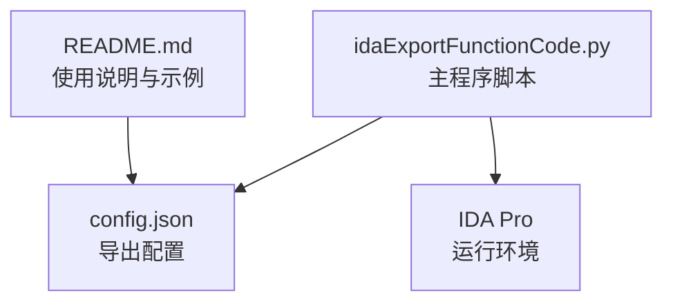
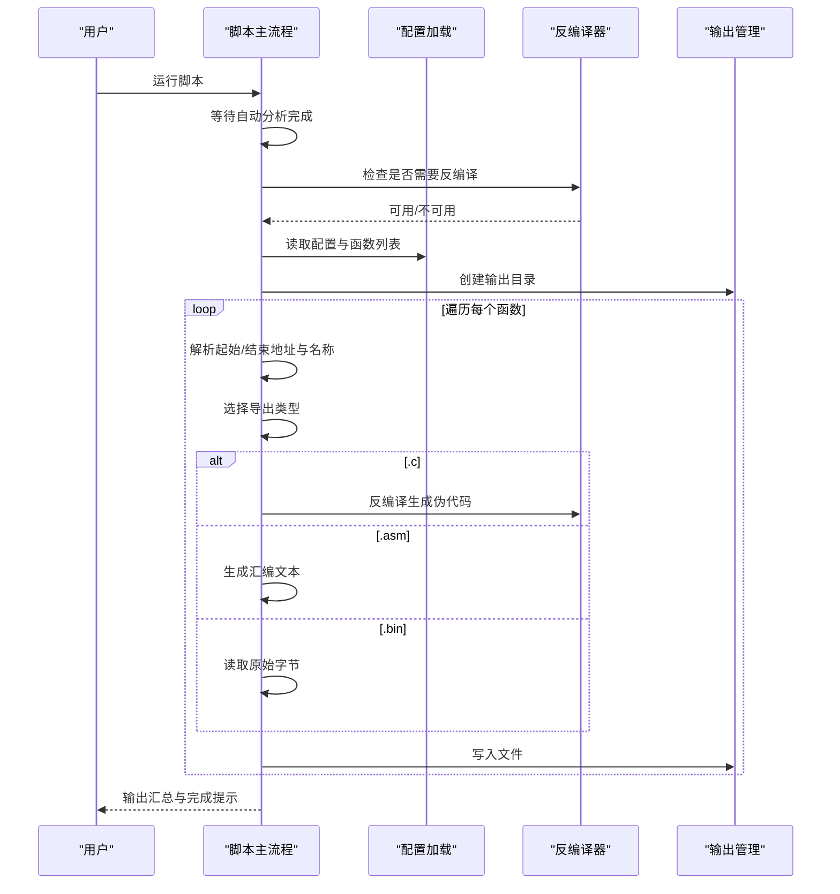
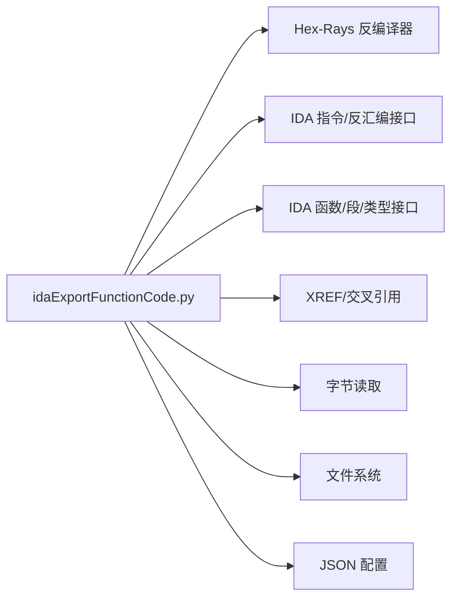

# 使用示例

<cite>
**本文引用的文件**
- [README.md](file://README.md)
- [config.json](file://config.json)
- [idaExportFunctionCode.py](file://idaExportFunctionCode.py)
</cite>

## 目录
1. [简介](#简介)
2. [项目结构](#项目结构)
3. [核心组件](#核心组件)
4. [架构总览](#架构总览)
5. [详细组件分析](#详细组件分析)
6. [依赖关系分析](#依赖关系分析)
7. [性能考虑](#性能考虑)
8. [故障排查指南](#故障排查指南)
9. [结论](#结论)
10. [附录](#附录)

## 简介
本工具是一个用于从IDA中导出指定函数代码的插件脚本，支持导出多种格式：
- .c：伪代码（Hex-Rays反编译）
- .asm：汇编代码（IDA风格格式，含XREF、loc标签）
- .bin：原始二进制字节

工具支持两种地址类型：
- 函数入口点：如 sub_xxx
- 非函数代码标签：如 loc_xxx

通过在配置文件中声明要导出的函数列表，即可批量导出目标函数到指定子目录。

## 项目结构
- README.md：项目说明与使用示例
- config.json：导出配置文件
- idaExportFunctionCode.py：主脚本，实现解析配置、导出逻辑与输出管理

图表来源
- [README.md](file://README.md#L1-L148)
- [config.json](file://config.json#L1-L71)
- [idaExportFunctionCode.py](file://idaExportFunctionCode.py#L1-L815)

章节来源
- [README.md](file://README.md#L1-L148)
- [config.json](file://config.json#L1-L71)
- [idaExportFunctionCode.py](file://idaExportFunctionCode.py#L1-L815)

## 核心组件
- 配置加载与解析：从同目录下的 config.json 加载全局设置与函数列表，并将十六进制字符串地址转换为整数
- 导出引擎：按函数逐个处理，根据导出类型分别生成 .c/.asm/.bin 文件
- 输出管理：自动创建输出目录，支持覆盖控制与结果汇总

章节来源
- [idaExportFunctionCode.py](file://idaExportFunctionCode.py#L31-L62)
- [idaExportFunctionCode.py](file://idaExportFunctionCode.py#L636-L724)

## 架构总览
整体流程如下：
- 启动时打印版本信息并等待IDA自动分析完成
- 检查是否需要反编译（若存在 .c 导出），并初始化Hex-Rays插件
- 获取输入文件路径，创建输出子目录
- 遍历函数列表，逐个导出各类型的文件
- 输出汇总统计与结果

图表来源
- [idaExportFunctionCode.py](file://idaExportFunctionCode.py#L730-L810)
- [idaExportFunctionCode.py](file://idaExportFunctionCode.py#L31-L62)

章节来源
- [idaExportFunctionCode.py](file://idaExportFunctionCode.py#L730-L810)

## 详细组件分析

### 配置文件 config.json
- 全局参数
  - isOverwrite：是否覆盖已存在文件，默认开启
  - outputSubFolderName：输出子目录名，默认 exportedCode/function
  - defaultExportTypes：默认导出类型列表，默认包含 .c 和 .asm
- 函数列表 functionList
  - 每个元素至少包含 startAddress 或 funcName（后者需满足 xxx_<hexAddress> 的命名约定）
  - 可选 endAddress：未提供时会尝试从IDA自动推断；对 loc_xxx 建议显式指定
  - 可选 exportTypes：覆盖全局默认导出类型

章节来源
- [README.md](file://README.md#L28-L72)
- [config.json](file://config.json#L1-L71)

### 主流程与导出逻辑
- 主流程 main
  - 等待分析完成
  - 按需检查Hex-Rays可用性
  - 创建输出目录
  - 遍历函数列表并导出
  - 打印汇总结果
- 单函数处理 processSingleFunction
  - 解析起始地址（直接提供或从函数名解析）
  - 解析函数名与结束地址
  - 生成基础文件名（若函数名已包含地址后缀则直接使用）
  - 针对每种导出类型调用对应导出函数并写入文件

章节来源
- [idaExportFunctionCode.py](file://idaExportFunctionCode.py#L730-L810)
- [idaExportFunctionCode.py](file://idaExportFunctionCode.py#L636-L724)

### 伪代码导出（.c）
- 调用 Hex-Rays 反编译接口生成伪代码
- 在输出文件顶部添加注释行，包含函数名与起始地址
- 失败时记录错误并跳过该类型导出

章节来源
- [idaExportFunctionCode.py](file://idaExportFunctionCode.py#L92-L113)

### 汇编导出（.asm）
- 生成IDA风格的头部、属性、函数原型注释、入口XREF、变量定义、__unwind 标记
- 收集跳转目标以生成 loc_xxx 标签，并在控制流终止指令后插入分隔线
- 对于内部跳转，显示从当前函数内部跳转到该标签的XREF
- 对 CALL 指令，附加被调函数的可重复注释作为续行
- 结尾输出“} // starts at ...”与“End of function ...”

章节来源
- [idaExportFunctionCode.py](file://idaExportFunctionCode.py#L372-L519)

### 二进制导出（.bin）
- 计算函数大小并从内存读取原始字节
- 失败时返回None并记录错误

章节来源
- [idaExportFunctionCode.py](file://idaExportFunctionCode.py#L521-L541)

### 地址与名称解析
- 起始地址解析：优先使用配置中的 startAddress；若缺失则尝试从 funcName 中解析十六进制后缀
- 结束地址解析：优先使用配置中的 endAddress；否则从IDA函数边界推断；若无法确定，提示必须显式指定
- 名称解析：优先使用IDA中的函数名；若无则使用标签名；否则回退为 func_<地址>

章节来源
- [idaExportFunctionCode.py](file://idaExportFunctionCode.py#L567-L635)

## 依赖关系分析
- IDA API 依赖
  - 自动分析等待：idaapi.auto_wait
  - 反编译：ida_hexrays.decompile、init_hexrays_plugin
  - 反汇编与指令遍历：idc.generate_disasm_line、idc.next_head、idc.print_insn_mnem、idc.get_operand_value
  - 函数与段信息：ida_funcs.get_func、idaapi.get_func_name、idaapi.getseg、idaapi.get_segm_name
  - XREF：idautils.XrefsTo、ida_xref.fl_* 类型常量
  - 字节读取：ida_bytes.get_bytes
- JSON 配置：json.load、json.dump（仅读取）
- 文件系统：os.path、os.makedirs、open（文本/二进制）

图表来源
- [idaExportFunctionCode.py](file://idaExportFunctionCode.py#L9-L21)
- [idaExportFunctionCode.py](file://idaExportFunctionCode.py#L31-L62)

章节来源
- [idaExportFunctionCode.py](file://idaExportFunctionCode.py#L9-L21)

## 性能考虑
- 反编译器可用性检测：仅当存在 .c 导出需求时才检查Hex-Rays，避免不必要的初始化开销
- 自动分析等待：在开始前等待分析完成，确保后续查询准确
- 输出覆盖策略：可通过 isOverwrite 控制是否覆盖已有文件，减少重复IO
- 批量导出：按函数列表顺序逐一处理，便于监控进度与失败重试

章节来源
- [idaExportFunctionCode.py](file://idaExportFunctionCode.py#L744-L756)
- [idaExportFunctionCode.py](file://idaExportFunctionCode.py#L554-L565)

## 故障排查指南
- 配置文件不存在或格式错误
  - 现象：提示找不到配置文件或加载失败
  - 排查：确认 config.json 存在于脚本同目录，且为合法JSON
- 缺少函数列表
  - 现象：提示 functionList 为空，请配置要导出的函数
  - 排查：在 config.json 中添加至少一个函数条目
- 无法解析起始地址
  - 现象：当仅提供 funcName 且不满足 xxx_<hexAddress> 规范时，提示无法解析地址
  - 排查：确保函数名包含十六进制后缀，或直接提供 startAddress
- 无法确定结束地址
  - 现象：对 loc_xxx 或非函数标签，若未显式提供 endAddress，会提示请在配置中指定
  - 排查：为 loc_xxx 显式设置 endAddress
- 反编译失败
  - 现象：提示无法反编译或异常
  - 排查：确认Hex-Rays插件可用；检查函数边界与类型信息
- 二进制读取失败
  - 现象：提示无法读取指定大小的字节
  - 排查：确认函数范围有效且可访问

章节来源
- [idaExportFunctionCode.py](file://idaExportFunctionCode.py#L39-L44)
- [idaExportFunctionCode.py](file://idaExportFunctionCode.py#L651-L660)
- [idaExportFunctionCode.py](file://idaExportFunctionCode.py#L588-L589)
- [idaExportFunctionCode.py](file://idaExportFunctionCode.py#L112-L114)
- [idaExportFunctionCode.py](file://idaExportFunctionCode.py#L533-L540)

## 结论
本工具通过简洁的配置与稳定的导出流程，满足安全研究人员、逆向工程师与开发者在不同场景下的代码导出需求。通过合理配置导出类型与地址范围，可高效地批量提取伪代码、汇编与二进制数据，便于进一步分析与归档。

## 附录

### 使用场景与最佳实践
- 安全研究人员
  - 目标：快速定位并导出可疑函数的伪代码与汇编，结合XREF与变量定义进行深入分析
  - 建议：为 loc_xxx 标签显式指定 endAddress，确保范围正确；优先导出 .c 与 .asm
- 逆向工程师
  - 目标：批量导出目标模块中的关键函数，建立本地对照与交叉引用
  - 建议：统一输出目录结构，启用 isOverwrite 以便更新；对复杂函数保留 .bin 以备回溯
- 软件开发者
  - 目标：导出第三方库或内核函数的伪代码，辅助接口理解与兼容性分析
  - 建议：结合函数原型注释与变量定义，形成可读性强的参考材料

### 常见使用模式
- 导出单个函数的伪代码与汇编
  - 在 functionList 中添加一个条目，设置 startAddress 或 funcName，并将 exportTypes 设为 [".c",".asm"]
- 批量导出多个函数
  - 在 functionList 中添加多个条目，统一使用全局 defaultExportTypes
- 自定义输出格式
  - 通过 exportTypes 覆盖默认导出类型，仅导出所需格式
- 处理特殊地址类型（如 loc_xxx）
  - 为 loc_xxx 显式设置 endAddress，避免自动推断失败

### 输出文件结构示例
- 输出目录：与输入二进制同级的 exportedCode/function/
- 示例文件名：
  - sub_A389.c / sub_A389.asm / sub_A389.bin
  - vmGetHandler_31BA0.c / vmGetHandler_31BA0.asm / vmGetHandler_31BA0.bin
  - loc_31D38.asm / loc_31D38.bin
  - myFunc_B000.c

章节来源
- [README.md](file://README.md#L77-L92)

### 完整配置示例（基于仓库现有配置）
- 全局设置
  - isOverwrite：true
  - outputSubFolderName：exportedCode/function
  - defaultExportTypes：[".c",".asm"]
- 函数列表（示例片段）
  - [{"startAddress":"0x322D4"},{"startAddress":"0x32FC8"},{"startAddress":"0x33014"}...]

章节来源
- [config.json](file://config.json#L1-L71)

### 运行步骤
- 在IDA中打开目标文件
- File -> Script file ... -> 选择并运行 idaExportFunctionCode.py
- 查看输出目录中的导出文件

章节来源
- [README.md](file://README.md#L73-L75)