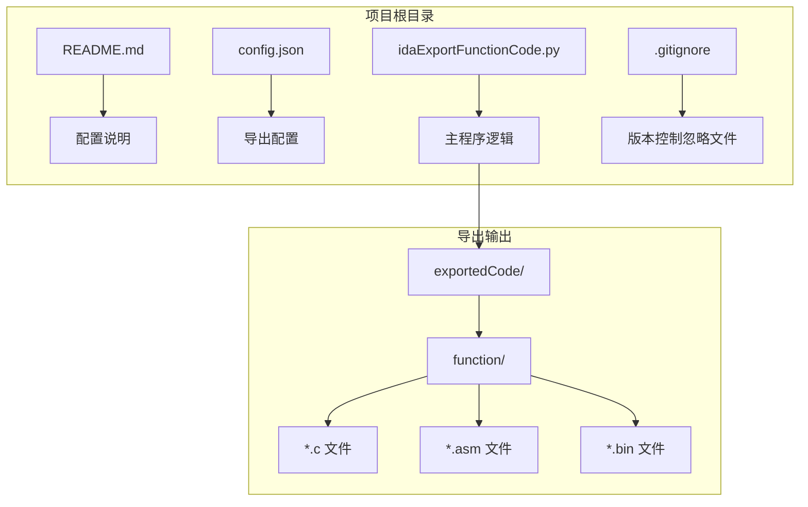
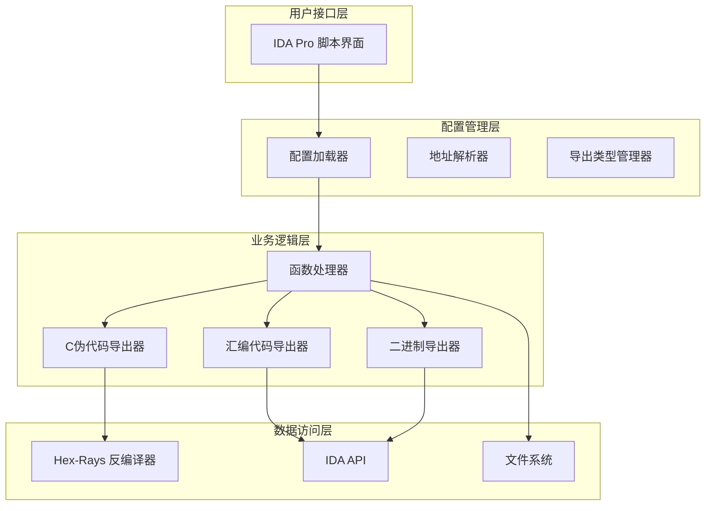
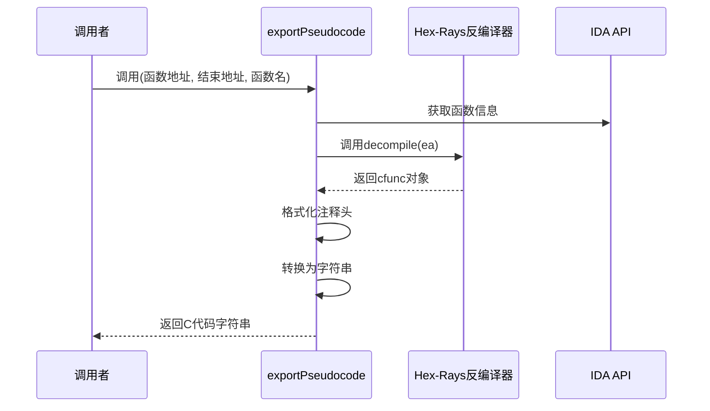
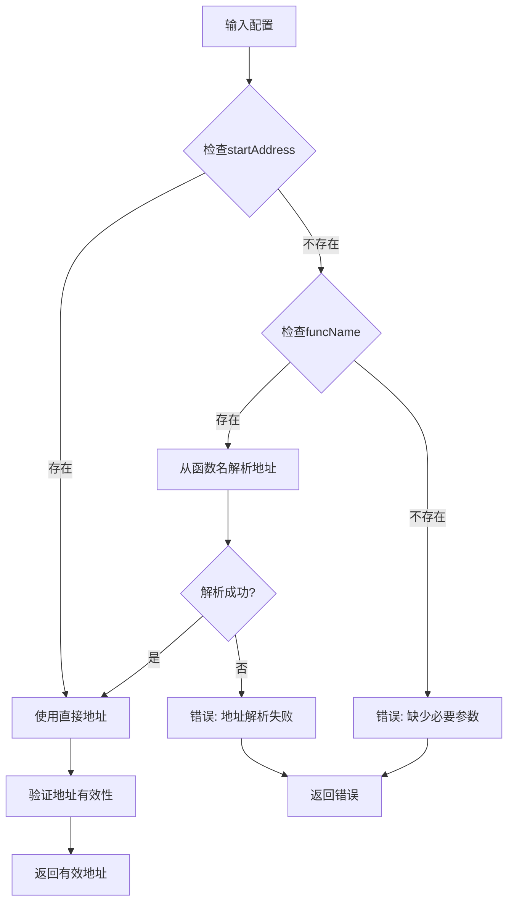
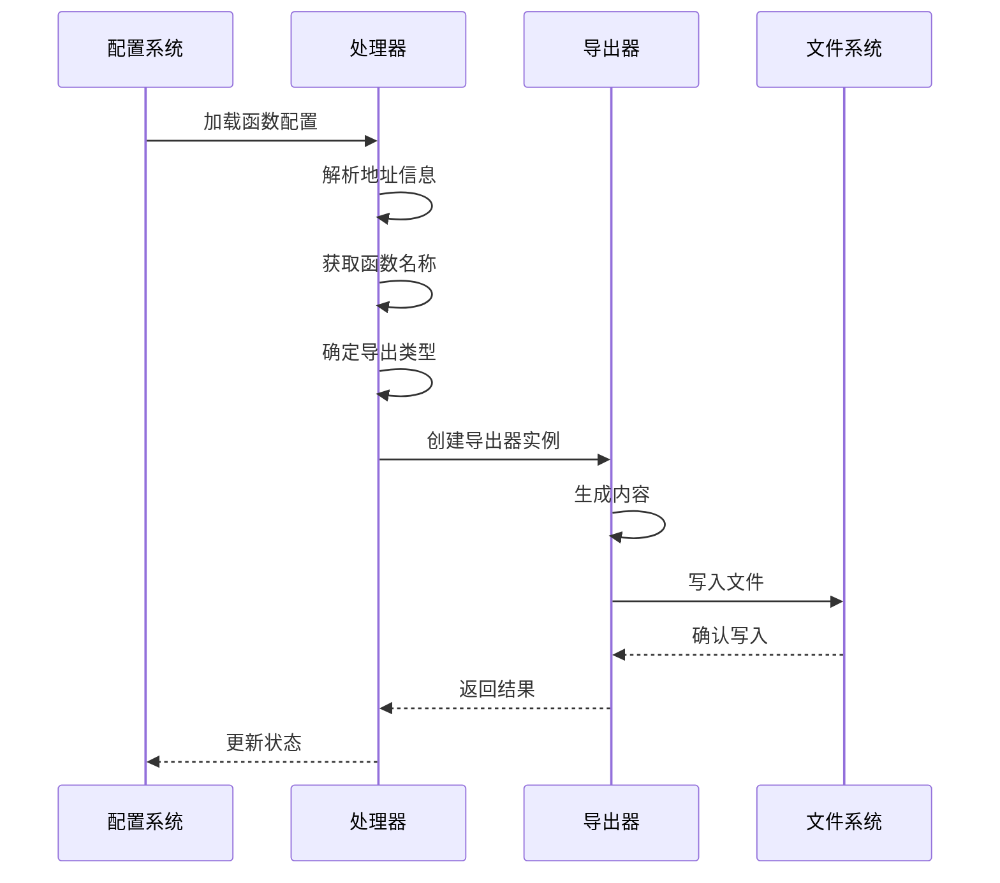
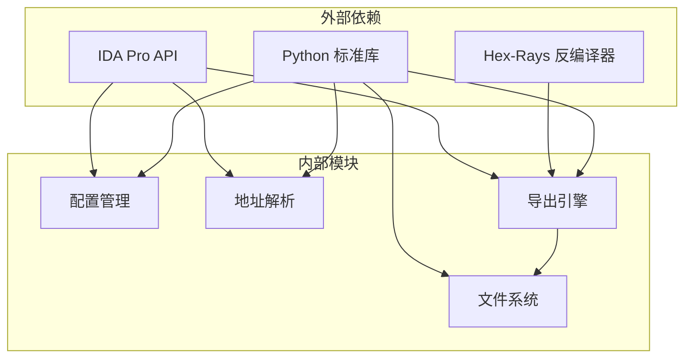

# C代码导出（伪代码）

<cite>
**本文档引用的文件**
- [README.md](file://README.md)
- [config.json](file://config.json)
- [idaExportFunctionCode.py](file://idaExportFunctionCode.py)
</cite>

## 目录
1. [简介](#简介)
2. [项目结构](#项目结构)
3. [核心组件](#核心组件)
4. [架构概览](#架构概览)
5. [详细组件分析](#详细组件分析)
6. [依赖关系分析](#依赖关系分析)
7. [性能考虑](#性能考虑)
8. [故障排除指南](#故障排除指南)
9. [结论](#结论)

## 简介

idaExportFunctionCode 是一个用于IDA Pro的插件脚本，专门设计用于将指定的函数代码导出到文件中。该工具支持多种导出格式，其中最重要的功能是C伪代码导出，通过Hex-Rays反编译器将机器码转换为可读的C语言代码。

该工具的主要特点包括：
- 支持从多种地址类型导出：函数入口点（sub_xxx）和代码标签（loc_xxx）
- 多格式导出：C伪代码、汇编代码、二进制数据
- 智能配置系统，允许批量导出多个函数
- 与IDA Pro深度集成，利用其强大的反编译能力

## 项目结构

该项目采用简洁的单文件架构，包含以下核心组件：



**图表来源**
- [idaExportFunctionCode.py](file://idaExportFunctionCode.py#L1-L815)
- [config.json](file://config.json#L1-L71)

**章节来源**
- [README.md](file://README.md#L1-L148)
- [config.json](file://config.json#L1-L71)
- [idaExportFunctionCode.py](file://idaExportFunctionCode.py#L1-L815)

## 核心组件

### 导出功能模块

该工具的核心功能围绕三个主要导出类型构建：

1. **C伪代码导出** - 使用Hex-Rays反编译器
2. **汇编代码导出** - 生成IDA风格的汇编代码
3. **二进制数据导出** - 提取原始字节码

每个导出类型都有专门的函数来处理特定的格式要求和数据提取逻辑。

### 配置管理系统

配置系统提供了灵活的导出控制机制：

- 全局设置：覆盖行为、输出目录、默认导出类型
- 函数级设置：每个函数的独立导出配置
- 地址解析：支持直接地址和函数名两种方式

**章节来源**
- [idaExportFunctionCode.py](file://idaExportFunctionCode.py#L31-L62)
- [config.json](file://config.json#L1-L71)

## 架构概览

该工具采用分层架构设计，从上到下分为以下层次：



**图表来源**
- [idaExportFunctionCode.py](file://idaExportFunctionCode.py#L731-L815)
- [idaExportFunctionCode.py](file://idaExportFunctionCode.py#L637-L725)

## 详细组件分析

### exportPseudocode函数详解

`exportPseudocode` 函数是整个工具的核心，负责将机器码转换为C伪代码。让我们深入分析其实现原理：

#### 函数签名和参数



**图表来源**
- [idaExportFunctionCode.py](file://idaExportFunctionCode.py#L93-L115)

#### 关键实现步骤

1. **函数地址解析**
   - 接收函数起始地址作为参数
   - 验证地址的有效性
   - 准备反编译环境

2. **反编译器调用**
   ```python
   cfunc = ida_hexrays.decompile(ea)
   ```
   - 使用Hex-Rays的`decompile`函数
   - 处理可能的异常情况
   - 验证返回结果的有效性

3. **代码格式化**
   - 添加函数注释头：`// Function: 函数名 @ 地址`
   - 将cfunc对象转换为字符串
   - 维护原有的格式和缩进

4. **错误处理**
   - 捕获反编译异常
   - 提供详细的错误信息
   - 返回None表示失败

#### 实现复杂度分析

- **时间复杂度**: O(n)，其中n是函数指令数量
- **空间复杂度**: O(n)，存储生成的C代码字符串
- **依赖关系**: 强依赖于Hex-Rays反编译器可用性

**章节来源**
- [idaExportFunctionCode.py](file://idaExportFunctionCode.py#L93-L115)

### 地址解析系统

地址解析系统支持多种输入格式，确保灵活性和易用性：



**图表来源**
- [idaExportFunctionCode.py](file://idaExportFunctionCode.py#L616-L635)
- [idaExportFunctionCode.py](file://idaExportFunctionCode.py#L637-L664)

#### 地址解析算法

地址解析采用正则表达式匹配模式：
- 支持 `xxx_<hexAddress>` 格式
- 自动识别十六进制地址
- 提供回退机制

**章节来源**
- [idaExportFunctionCode.py](file://idaExportFunctionCode.py#L616-L635)

### 导出流程管理

导出流程采用统一的处理管道，确保一致性和可靠性：



**图表来源**
- [idaExportFunctionCode.py](file://idaExportFunctionCode.py#L637-L725)

**章节来源**
- [idaExportFunctionCode.py](file://idaExportFunctionCode.py#L637-L725)

## 依赖关系分析

该工具的依赖关系相对简单但功能强大：



**图表来源**
- [idaExportFunctionCode.py](file://idaExportFunctionCode.py#L9-L21)

### 主要依赖项

1. **IDA Pro API** - 提供反汇编、函数信息、内存访问等核心功能
2. **Hex-Rays 反编译器** - 实现机器码到C代码的转换
3. **Python标准库** - 提供文件操作、正则表达式、JSON处理等功能

**章节来源**
- [idaExportFunctionCode.py](file://idaExportFunctionCode.py#L9-L21)

## 性能考虑

### 反编译性能优化

- **延迟初始化**: 只在需要时初始化Hex-Rays插件
- **批量处理**: 支持同时导出多个函数
- **内存管理**: 合理处理大函数的反编译结果

### I/O性能优化

- **异步写入**: 文件写入采用缓冲机制
- **增量处理**: 支持部分导出和断点续传
- **压缩输出**: 可选的文件压缩选项

## 故障排除指南

### 常见问题及解决方案

#### Hex-Rays不可用

**问题**: 反编译器初始化失败
**原因**: 
- Hex-Rays插件未安装或禁用
- IDA版本不兼容
- 许可证问题

**解决方案**:
1. 检查Hex-Rays插件状态
2. 验证IDA版本兼容性
3. 重新安装或激活插件

#### 地址解析失败

**问题**: 无法从函数名解析地址
**原因**:
- 函数名格式不正确
- 地址不在十六进制格式
- 函数不存在

**解决方案**:
1. 使用直接地址格式
2. 检查函数名格式
3. 验证地址范围

#### 文件写入权限

**问题**: 无法写入导出文件
**原因**:
- 输出目录权限不足
- 磁盘空间不足
- 文件被占用

**解决方案**:
1. 检查输出目录权限
2. 清理磁盘空间
3. 关闭占用文件的应用程序

**章节来源**
- [idaExportFunctionCode.py](file://idaExportFunctionCode.py#L749-L758)
- [idaExportFunctionCode.py](file://idaExportFunctionCode.py#L652-L664)

## 结论

idaExportFunctionCode是一个功能强大且易于使用的IDA Pro插件，专门用于函数代码的批量导出。其核心优势包括：

### 技术优势

1. **精确的反编译**: 利用Hex-Rays的高质量反编译器
2. **灵活的配置**: 支持复杂的批量导出场景
3. **稳定的集成**: 与IDA Pro无缝集成
4. **完善的错误处理**: 提供详细的错误信息和恢复机制

### 使用价值

1. **逆向工程**: 便于分析和理解复杂函数逻辑
2. **代码重用**: 生成的C代码可作为参考实现
3. **文档生成**: 自动生成函数级别的技术文档
4. **协作共享**: 标准化的输出格式便于团队协作

### 发展前景

该工具为IDA Pro用户提供了强大的代码导出能力，特别适合需要进行大规模函数分析和代码重构的场景。随着Hex-Rays反编译技术的不断改进，该工具的价值将进一步提升。