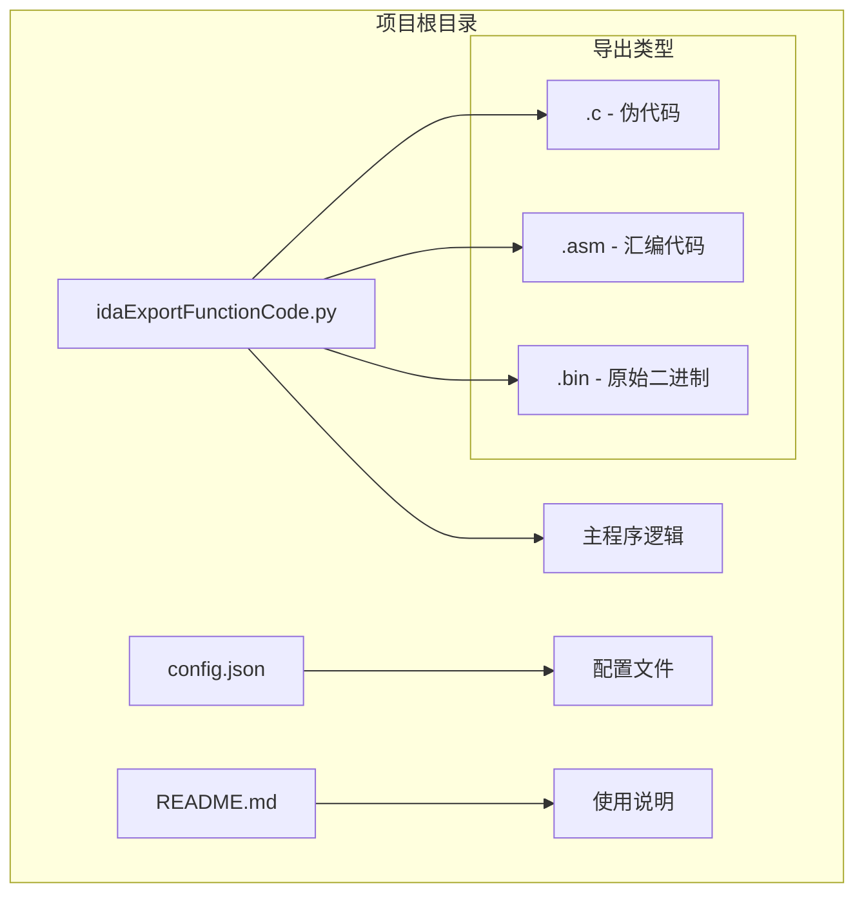
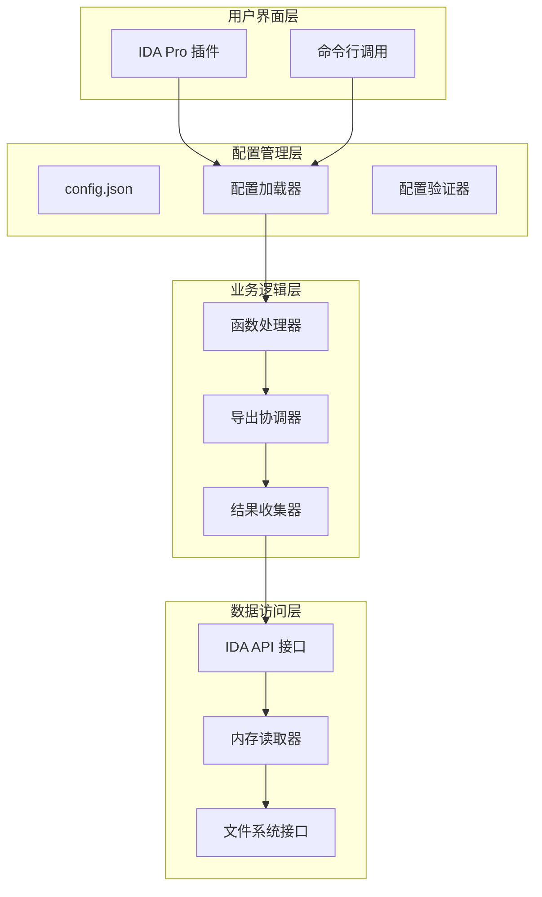
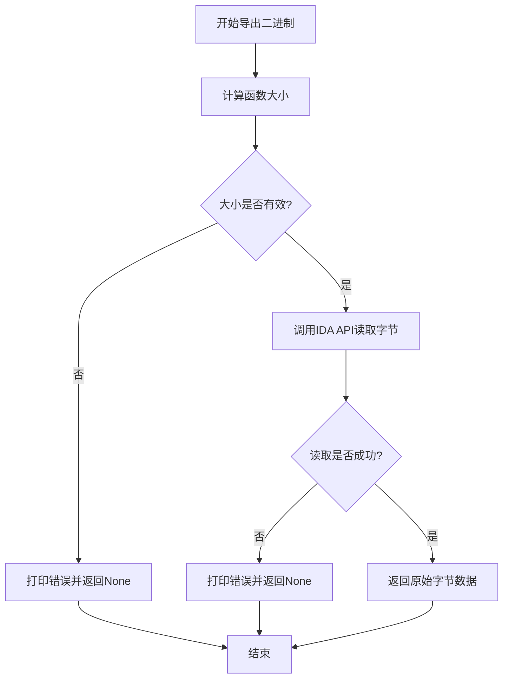
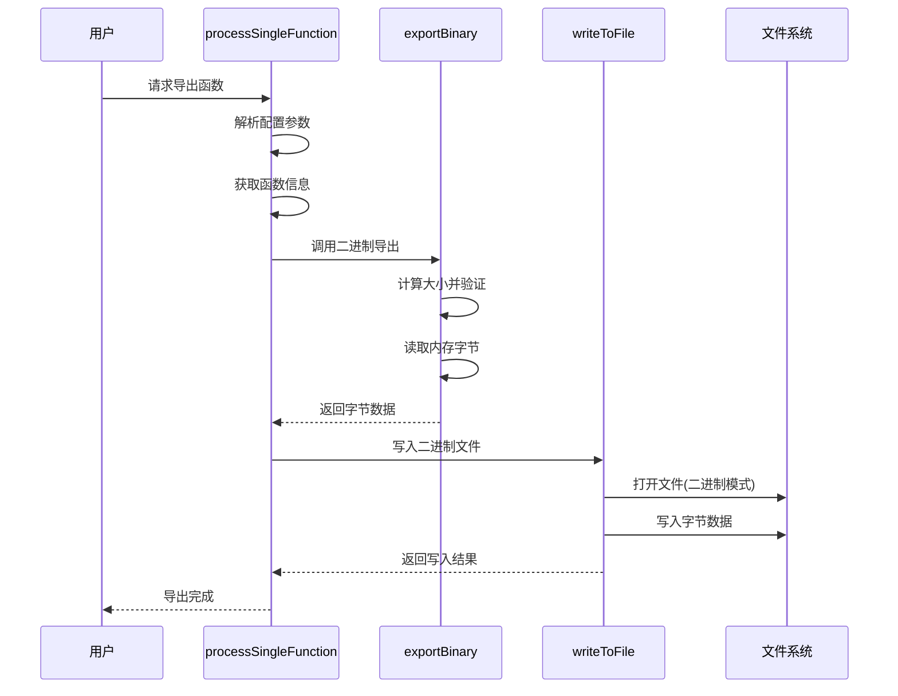
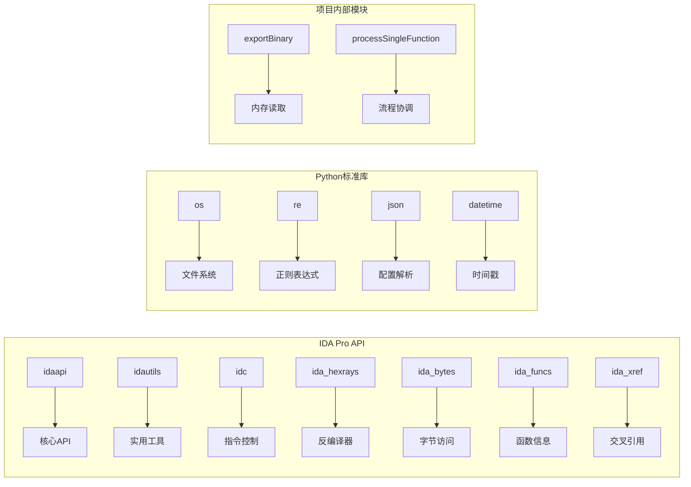
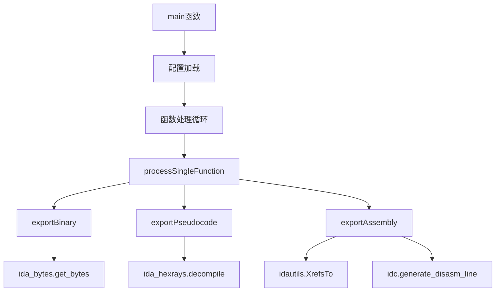

# 二进制数据导出

<cite>
**本文档引用的文件**
- [README.md](file://README.md)
- [config.json](file://config.json)
- [idaExportFunctionCode.py](file://idaExportFunctionCode.py)
</cite>

## 目录
1. [简介](#简介)
2. [项目结构](#项目结构)
3. [核心组件](#核心组件)
4. [架构概览](#架构概览)
5. [详细组件分析](#详细组件分析)
6. [依赖关系分析](#依赖关系分析)
7. [性能考虑](#性能考虑)
8. [故障排除指南](#故障排除指南)
9. [结论](#结论)
10. [附录](#附录)

## 简介

IDA反汇编函数代码导出工具是一个用于从IDA Pro反汇编器中批量导出指定函数代码的插件。该工具支持三种导出格式：伪代码（.c）、汇编代码（.asm）和原始二进制数据（.bin）。本文档专注于二进制数据导出功能，深入解释exportBinary函数的实现原理，包括如何直接提取函数的原始字节数据。

该工具的主要应用场景包括：
- 逆向工程分析：提取函数的原始机器码进行深度分析
- 补丁制作：获取原始字节数据用于修改或替换特定函数
- 代码比较：对比不同版本或不同构建中的函数字节差异
- 恶意软件分析：提取恶意代码片段进行静态分析
- 软件取证：保留原始二进制数据作为证据

## 项目结构

该项目采用简洁的单文件架构设计，包含以下核心文件：



**图表来源**
- [idaExportFunctionCode.py](file://idaExportFunctionCode.py#L1-L815)
- [config.json](file://config.json#L1-L71)

**章节来源**
- [idaExportFunctionCode.py](file://idaExportFunctionCode.py#L1-L815)
- [config.json](file://config.json#L1-L71)
- [README.md](file://README.md#L1-L148)

## 核心组件

### 导出二进制数据函数

exportBinary函数是二进制导出功能的核心实现，负责直接从内存中提取函数的原始字节数据。该函数实现了完整的错误处理和数据验证机制。

**章节来源**
- [idaExportFunctionCode.py](file://idaExportFunctionCode.py#L522-L542)

### 配置管理系统

系统通过config.json文件管理导出配置，支持全局设置和每个函数的独立配置。配置项包括覆盖选项、输出目录、默认导出类型和函数列表。

**章节来源**
- [config.json](file://config.json#L1-L71)
- [idaExportFunctionCode.py](file://idaExportFunctionCode.py#L31-L62)

### 文件写入系统

writeToFile函数提供了统一的文件写入接口，支持文本和二进制模式。该函数包含了文件存在性检查和覆盖控制逻辑。

**章节来源**
- [idaExportFunctionCode.py](file://idaExportFunctionCode.py#L544-L565)

## 架构概览

该工具采用模块化设计，主要包含以下架构层次：



**图表来源**
- [idaExportFunctionCode.py](file://idaExportFunctionCode.py#L731-L815)
- [config.json](file://config.json#L1-L71)

## 详细组件分析

### exportBinary函数实现详解

exportBinary函数是二进制导出功能的核心实现，其工作流程如下：

#### 函数签名与参数
- 参数：ea（函数起始地址）、funcEndAddr（函数结束地址）、funcName（函数名称）
- 返回值：bytes对象或None

#### 核心处理流程



**图表来源**
- [idaExportFunctionCode.py](file://idaExportFunctionCode.py#L522-L542)

#### 大小计算与验证

函数首先计算目标函数的大小：`size = funcEndAddr - ea`。如果计算结果小于等于0，函数会记录错误并提前返回。这个验证确保了导出操作的有效性和安全性。

#### 内存读取机制

使用IDA的ida_bytes.get_bytes(ea, size) API进行内存读取。该API能够安全地从指定内存地址读取连续的字节数据，处理内存映射和权限问题。

#### 数据完整性检查

读取操作后，函数检查返回值是否为None。如果为None，表示内存访问失败或数据不可用，函数会记录相应的错误信息并返回None。

**章节来源**
- [idaExportFunctionCode.py](file://idaExportFunctionCode.py#L522-L542)

### 导出流程协调器

processSingleFunction函数负责协调单个函数的完整导出流程，包括二进制导出在内的所有导出类型。



**图表来源**
- [idaExportFunctionCode.py](file://idaExportFunctionCode.py#L637-L725)

**章节来源**
- [idaExportFunctionCode.py](file://idaExportFunctionCode.py#L637-L725)

### 配置解析与验证

系统提供了灵活的配置解析机制，支持多种地址格式和函数标识方式：

#### 地址解析策略
- 直接十六进制地址：`"0x322D4"`
- 函数名解析：`"vmGetHandler_31BA0"` → 自动解析为`0x31BA0`
- 混合配置：同时提供函数名和地址时优先使用配置中的地址

#### 函数信息获取
- 优先使用配置中的函数名
- 如果配置中没有函数名，尝试从IDA数据库获取
- 最后回退到使用地址作为函数名

**章节来源**
- [idaExportFunctionCode.py](file://idaExportFunctionCode.py#L591-L635)

## 依赖关系分析

### 外部依赖

该工具依赖于IDA Pro提供的API接口，主要包括：



**图表来源**
- [idaExportFunctionCode.py](file://idaExportFunctionCode.py#L9-L21)

### 内部依赖关系



**图表来源**
- [idaExportFunctionCode.py](file://idaExportFunctionCode.py#L731-L815)

**章节来源**
- [idaExportFunctionCode.py](file://idaExportFunctionCode.py#L9-L21)
- [idaExportFunctionCode.py](file://idaExportFunctionCode.py#L731-L815)

## 性能考虑

### 内存访问优化

- **批量读取**：exportBinary函数一次性读取整个函数范围的字节，避免多次内存访问
- **缓存机制**：IDA Pro内部已经对频繁访问的数据进行了缓存优化
- **错误快速返回**：在检测到无效参数时立即返回，避免不必要的内存访问

### 文件I/O优化

- **二进制模式写入**：使用二进制模式写入可以避免字符编码转换开销
- **文件存在性检查**：在写入前检查文件是否存在，避免不必要的I/O操作
- **UTF-8编码**：对于非二进制文件使用UTF-8编码确保跨平台兼容性

## 故障排除指南

### 常见问题及解决方案

#### 1. 内存访问权限错误
**症状**：导出二进制数据时出现内存访问失败
**原因**：目标地址不在可访问的内存范围内
**解决方案**：
- 确认函数地址正确无误
- 检查目标进程的内存映射
- 验证IDA Pro具有足够的权限访问目标内存

#### 2. 函数边界确定错误
**症状**：导出的二进制数据不完整或包含意外内容
**原因**：函数结束地址计算不准确
**解决方案**：
- 显式指定`endAddress`参数
- 在配置文件中明确函数边界
- 使用IDA Pro的函数分析功能验证边界

#### 3. 文件写入失败
**症状**：导出文件无法创建或写入
**原因**：输出目录权限不足或磁盘空间不足
**解决方案**：
- 检查输出目录的写入权限
- 确保有足够的磁盘空间
- 验证文件路径的有效性

#### 4. 配置解析错误
**症状**：函数名解析失败或地址转换错误
**原因**：配置格式不符合预期
**解决方案**：
- 检查函数名格式是否为`prefix_hexAddress`
- 验证十六进制地址的格式正确性
- 确认配置文件的JSON语法正确

**章节来源**
- [idaExportFunctionCode.py](file://idaExportFunctionCode.py#L532-L542)
- [idaExportFunctionCode.py](file://idaExportFunctionCode.py#L588-L589)
- [idaExportFunctionCode.py](file://idaExportFunctionCode.py#L554-L565)
- [idaExportFunctionCode.py](file://idaExportFunctionCode.py#L652-L660)

## 结论

IDA反汇编函数代码导出工具的二进制数据导出功能通过exportBinary函数实现了高效、可靠的原始字节数据提取。该实现具有以下特点：

### 技术优势
- **直接内存访问**：使用IDA Pro的原生API直接从内存中读取字节数据
- **完整的错误处理**：包含输入验证、内存访问检查和文件写入验证
- **灵活的配置支持**：支持多种地址格式和函数标识方式
- **模块化设计**：清晰的函数分离和职责划分

### 应用价值
- **逆向工程**：为深度分析提供原始数据基础
- **补丁开发**：支持精确的代码修改和替换
- **安全研究**：便于恶意软件分析和威胁情报收集
- **软件取证**：确保数据的完整性和可追溯性

### 局限性与改进方向
- **依赖IDA Pro环境**：需要在IDA Pro环境中运行
- **内存权限限制**：受目标进程内存访问权限约束
- **大型函数性能**：对于超大函数可能影响性能
- **多架构支持**：当前主要针对ARM64架构优化

该工具为逆向工程师和安全研究人员提供了一个强大而灵活的二进制数据导出解决方案，能够满足大多数逆向分析场景的需求。

## 附录

### 使用示例

#### 基本二进制导出示例
```json
{
  "startAddress": "0xA389",
  "exportTypes": [".bin"]
}
```

#### 复杂场景配置
```json
{
  "funcName": "vmGetHandler_31BA0",
  "startAddress": "0x31D38",
  "endAddress": "0x31D40",
  "exportTypes": [".bin"]
}
```

### 支持的导出类型

| 类型 | 描述 | 输出格式 |
|------|------|----------|
| .c | 伪代码 | C语言源代码 |
| .asm | 汇编代码 | IDA风格汇编代码 |
| .bin | 原始二进制 | 原始字节数据 |

### 技术规格

- **输入格式**：十六进制字符串或十进制整数
- **输出格式**：二进制文件（.bin）
- **文件命名**：`{函数名}[_{地址}]`
- **输出位置**：与输入文件同目录下的子文件夹