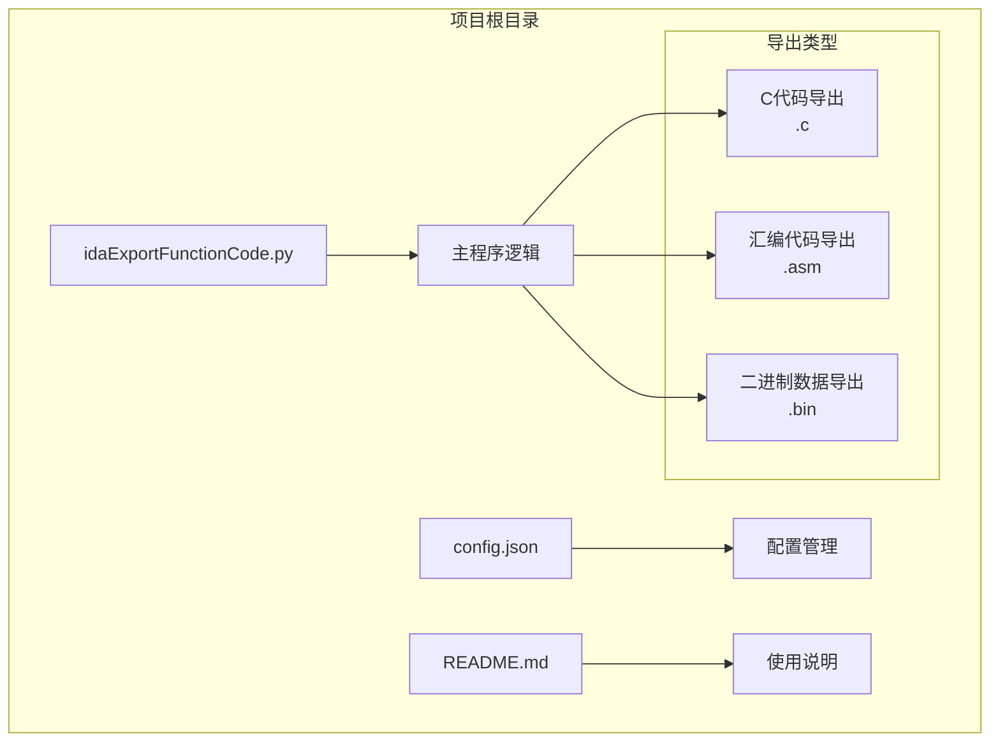
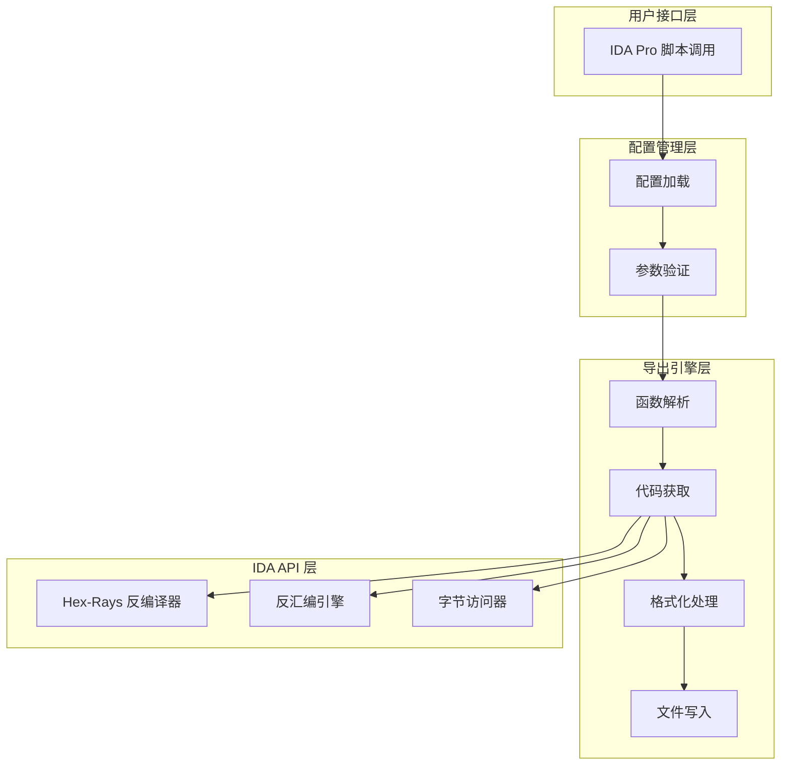
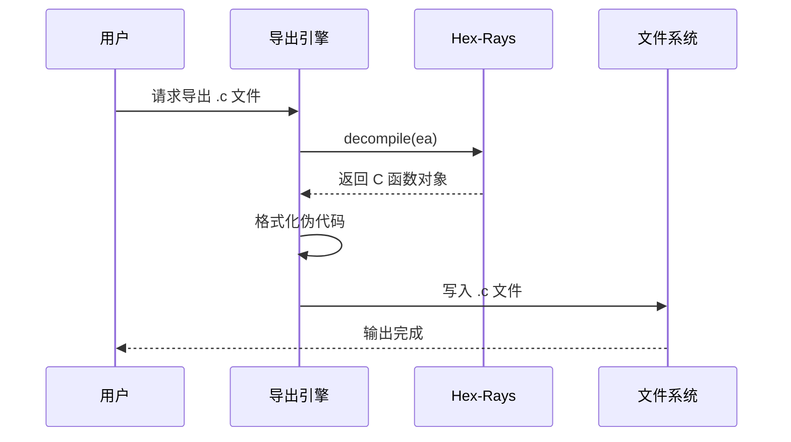
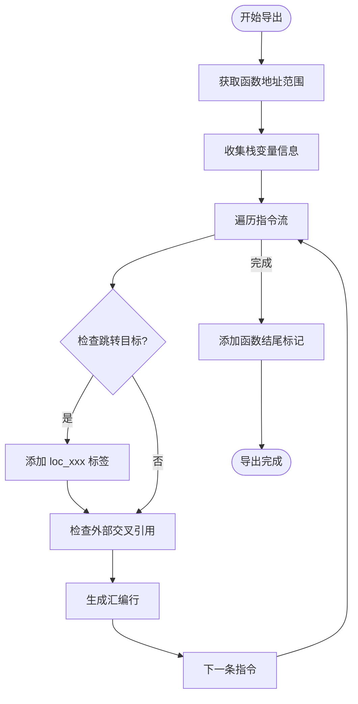
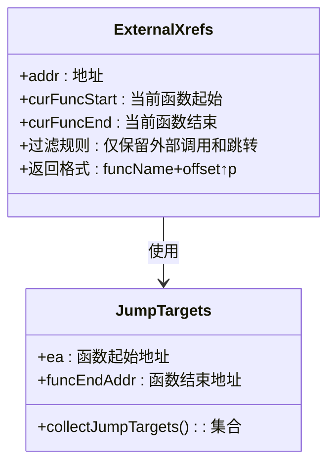
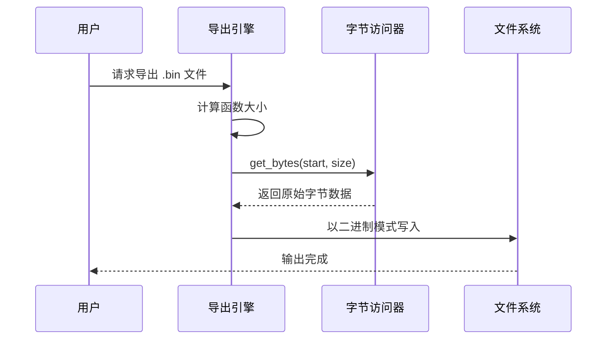
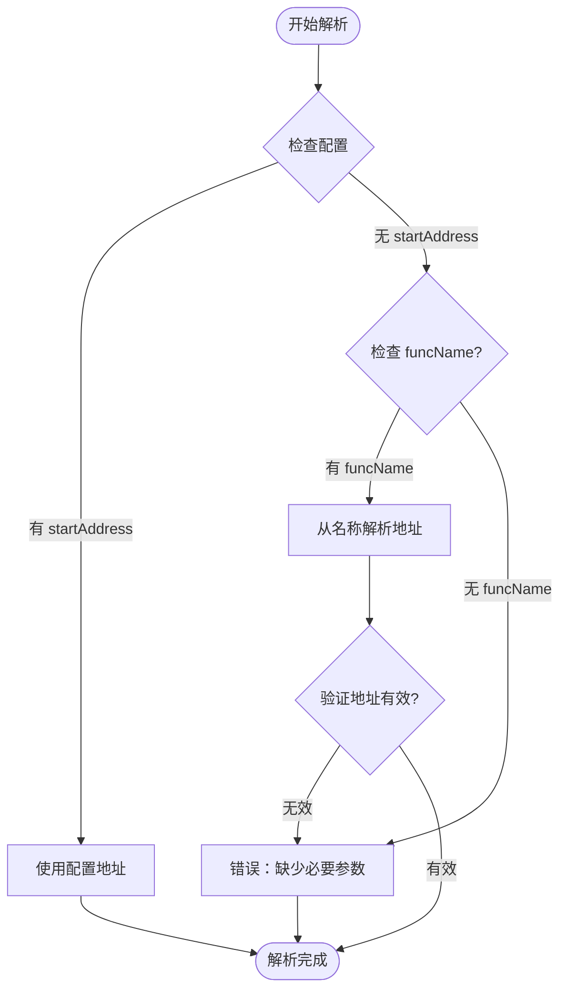
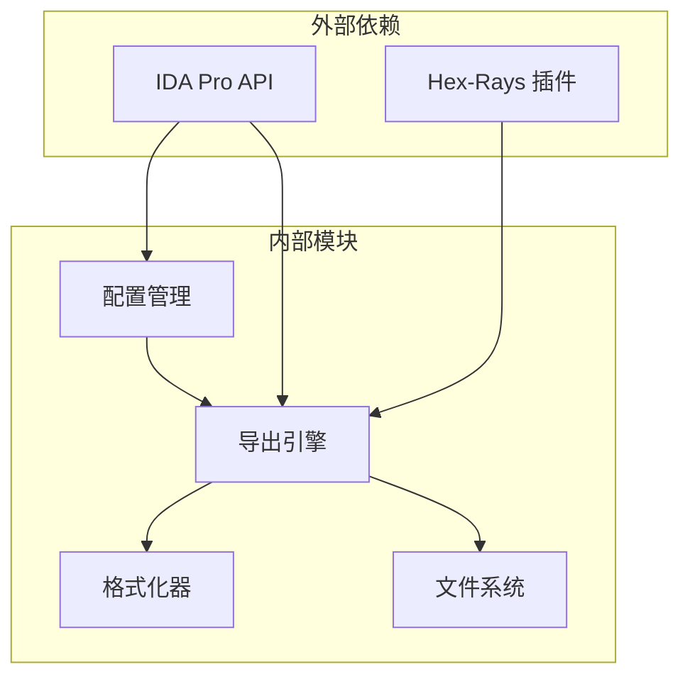

# 导出功能说明

<cite>
**本文档引用的文件**
- [README.md](file://README.md)
- [config.json](file://config.json)
- [idaExportFunctionCode.py](file://idaExportFunctionCode.py)
</cite>

## 目录
1. [简介](#简介)
2. [项目结构](#项目结构)
3. [核心组件](#核心组件)
4. [架构概览](#架构概览)
5. [详细组件分析](#详细组件分析)
6. [依赖关系分析](#依赖关系分析)
7. [性能考虑](#性能考虑)
8. [故障排除指南](#故障排除指南)
9. [结论](#结论)

## 简介

idaExportFunctionCode 是一个专为 IDA Pro 设计的插件，用于将指定的函数代码导出到文件中。该工具支持三种不同的导出格式：

- **C代码导出（.c）**：通过 Hex-Rays 反编译器生成伪代码
- **汇编代码导出（.asm）**：IDA 风格的汇编格式，包含交叉引用和标签
- **二进制数据导出（.bin）**：原始字节数据

该工具提供了灵活的配置选项，允许用户指定要导出的函数列表、输出目录以及导出类型。

## 项目结构

项目采用简洁的单文件架构，包含以下主要组件：

**图表来源**
- [idaExportFunctionCode.py](file://idaExportFunctionCode.py#L1-L815)
- [config.json](file://config.json#L1-L71)

**章节来源**
- [idaExportFunctionCode.py](file://idaExportFunctionCode.py#L1-L815)
- [config.json](file://config.json#L1-L71)

## 核心组件

### 配置系统

配置系统是整个工具的核心，负责管理导出参数和函数列表。配置文件支持以下关键参数：

- **全局设置**：
  - `isOverwrite`：是否覆盖已存在的输出文件
  - `outputSubFolderName`：输出子文件夹名称
  - `defaultExportTypes`：默认导出类型列表

- **函数配置**：
  - `startAddress`：函数起始地址（十六进制字符串）
  - `endAddress`：函数结束地址（可选）
  - `funcName`：函数名称（可选）
  - `exportTypes`：特定函数的导出类型（可选）

### 导出引擎

导出引擎负责协调整个导出过程，包括函数地址解析、代码获取、格式化处理和文件保存。

**章节来源**
- [config.json](file://config.json#L1-L71)
- [idaExportFunctionCode.py](file://idaExportFunctionCode.py#L31-L62)

## 架构概览

该工具采用模块化设计，主要分为以下几个层次：

**图表来源**
- [idaExportFunctionCode.py](file://idaExportFunctionCode.py#L731-L815)

## 详细组件分析

### C代码导出（伪代码）

C代码导出通过 Hex-Rays 反编译器生成高质量的伪代码。实现原理如下：

#### 技术实现

**图表来源**
- [idaExportFunctionCode.py](file://idaExportFunctionCode.py#L93-L115)

#### 特点和优势

- **高质量伪代码**：利用 Hex-Rays 的深度分析能力
- **类型信息保留**：包含完整的变量类型和函数签名
- **结构化表示**：生成接近原生 C 代码的结构
- **自动注释**：包含变量定义和函数原型注释

#### 适用场景

- 逆向工程分析
- 代码理解与学习
- 安全研究和漏洞分析
- 代码重构和移植

**章节来源**
- [idaExportFunctionCode.py](file://idaExportFunctionCode.py#L93-L115)

### 汇编代码导出（IDA风格）

汇编代码导出生成标准的 IDA 风格汇编代码，包含丰富的交叉引用信息。

#### 技术实现

**图表来源**
- [idaExportFunctionCode.py](file://idaExportFunctionCode.py#L373-L521)

#### 核心特性

- **16位地址格式**：使用 `segment:0000000000XXXXXX` 格式
- **交叉引用显示**：包含箭头指示（↑↓）和后缀标识（p/j）
- **函数原型注释**：从 IDA 类型信息生成
- **变量定义**：格式化的偏移量定义
- **控制流标记**：`__unwind {` 和 `}` 块标记
- **分隔线**：在控制流终止指令后添加分隔线

#### 交叉引用处理

**图表来源**
- [idaExportFunctionCode.py](file://idaExportFunctionCode.py#L116-L199)

#### 适用场景

- 低级代码分析
- 性能优化研究
- 汇编语言学习
- 二进制补丁开发

**章节来源**
- [idaExportFunctionCode.py](file://idaExportFunctionCode.py#L373-L521)
- [idaExportFunctionCode.py](file://idaExportFunctionCode.py#L116-L199)

### 二进制数据导出（原始字节）

二进制数据导出直接提取函数的原始字节数据，适用于需要精确字节级操作的场景。

#### 技术实现

**图表来源**
- [idaExportFunctionCode.py](file://idaExportFunctionCode.py#L522-L543)

#### 特点和优势

- **精确字节级**：无任何格式化或解释
- **完整性保证**：包含所有原始机器码
- **快速导出**：最小的处理开销
- **通用性**：适用于任何二进制分析工具

#### 适用场景

- 机器码分析
- 补丁制作
- 逆向工程取证
- 二进制比较和匹配

**章节来源**
- [idaExportFunctionCode.py](file://idaExportFunctionCode.py#L522-L543)

### 函数地址解析系统

函数地址解析是工具的关键组件，支持多种地址解析方式：

**图表来源**
- [idaExportFunctionCode.py](file://idaExportFunctionCode.py#L616-L636)

#### 解析策略

1. **直接地址**：从配置中直接获取十六进制地址
2. **名称解析**：从函数名称的十六进制后缀解析地址
3. **自动检测**：通过 IDA API 自动确定函数边界

**章节来源**
- [idaExportFunctionCode.py](file://idaExportFunctionCode.py#L616-L636)

## 依赖关系分析

工具的依赖关系相对简单，主要依赖于 IDA Pro 提供的 API：

**图表来源**
- [idaExportFunctionCode.py](file://idaExportFunctionCode.py#L9-L21)

### 关键依赖说明

- **IDA API**：提供反汇编、函数分析、字节访问等功能
- **Hex-Rays**：提供高级反编译能力（仅 .c 导出时需要）
- **Python 标准库**：文件操作、JSON 处理、正则表达式等

**章节来源**
- [idaExportFunctionCode.py](file://idaExportFunctionCode.py#L9-L21)

## 性能考虑

### 导出性能优化

1. **延迟初始化**：仅在需要时初始化 Hex-Rays 插件
2. **批量处理**：支持一次导出多个函数
3. **内存管理**：及时释放不再使用的数据结构
4. **I/O 优化**：批量写入文件，减少磁盘操作

### 内存使用

- **配置数据**：常量大小，影响极小
- **函数数据**：按函数大小线性增长
- **临时缓冲区**：最大约为函数大小的两倍

## 故障排除指南

### 常见问题及解决方案

#### Hex-Rays 不可用

**问题**：尝试导出 .c 文件时报错 "Hex-Rays decompiler is not available"

**原因**：IDA Pro 中未安装或禁用 Hex-Rays 插件

**解决方案**：
1. 确保 IDA Pro 安装了 Hex-Rays 插件
2. 在 IDA Pro 中启用 Hex-Rays 插件
3. 重新运行脚本进行 .asm 和 .bin 导出

#### 函数边界无法确定

**问题**：报错 "Cannot determine end address for XXX, please specify endAddress in config"

**原因**：对于非函数标签（如 loc_xxx），无法自动确定函数结束地址

**解决方案**：
1. 在配置文件中明确指定 `endAddress`
2. 确保函数地址正确且有效
3. 检查 IDA 数据库中的函数定义

#### 权限问题

**问题**：无法写入输出文件

**原因**：输出目录权限不足或文件被占用

**解决方案**：
1. 检查输出目录的写入权限
2. 关闭可能占用文件的程序
3. 更改输出目录路径

#### 配置错误

**问题**：配置文件格式错误或参数缺失

**解决方案**：
1. 使用 JSON 验证工具检查配置文件格式
2. 确保所有必需参数都已正确设置
3. 参考配置示例文件进行修正

**章节来源**
- [idaExportFunctionCode.py](file://idaExportFunctionCode.py#L749-L758)
- [idaExportFunctionCode.py](file://idaExportFunctionCode.py#L588-L589)

## 结论

idaExportFunctionCode 是一个功能完整、设计合理的 IDA Pro 插件，提供了三种不同层次的代码导出能力：

1. **C代码导出**：适合高层次的代码分析和理解
2. **汇编代码导出**：适合低级别的详细分析和学习
3. **二进制数据导出**：适合精确的字节级操作和处理

该工具的主要优势包括：
- 灵活的配置系统
- 完整的交叉引用信息
- 标准化的输出格式
- 错误处理和诊断能力

通过合理使用该工具，可以显著提高逆向工程工作的效率和质量。