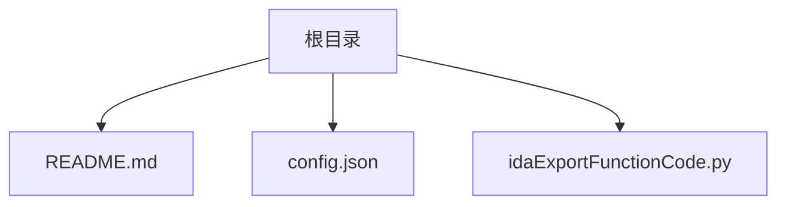
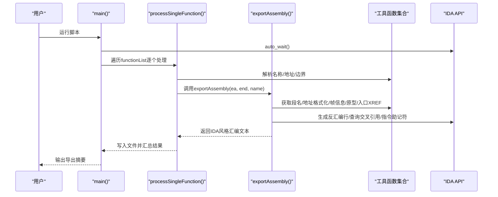
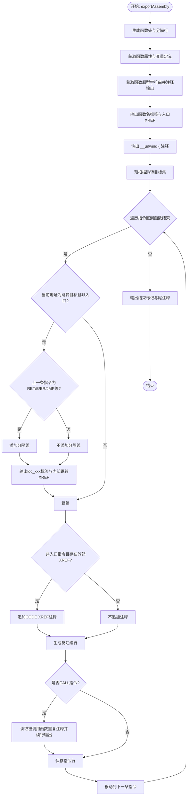
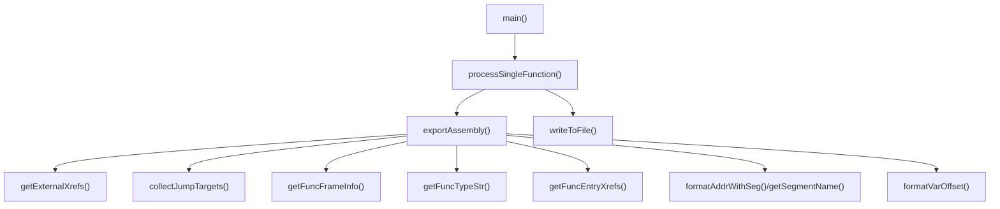

# 汇编代码导出

<cite>
**本文引用的文件**
- [README.md](file://README.md)
- [config.json](file://config.json)
- [idaExportFunctionCode.py](file://idaExportFunctionCode.py)
</cite>

## 目录
1. [简介](#简介)
2. [项目结构](#项目结构)
3. [核心组件](#核心组件)
4. [架构总览](#架构总览)
5. [详细组件分析](#详细组件分析)
6. [依赖关系分析](#依赖关系分析)
7. [性能考量](#性能考量)
8. [故障排查指南](#故障排查指南)
9. [结论](#结论)
10. [附录](#附录)

## 简介
本文件聚焦于IDA反汇编函数代码导出工具中的“汇编代码导出”能力，系统性阐述exportAssembly函数的实现原理与技术特色，覆盖从函数头信息到指令序列生成的完整流程，包括属性标注、原型声明、标签系统、交叉引用显示、地址格式化、段名处理以及错误处理机制。同时给出典型输出示例与注释样式说明，帮助读者快速理解并正确使用该导出功能。

## 项目结构
- 根目录包含一个Python脚本用于在IDA Pro中运行，以及一个配置文件用于定义待导出函数列表与默认导出类型。
- README提供了功能概述、使用方法、输出示例与特性说明。

图表来源
- [README.md](file://README.md#L1-L148)
- [config.json](file://config.json#L1-L71)
- [idaExportFunctionCode.py](file://idaExportFunctionCode.py#L1-L815)

章节来源
- [README.md](file://README.md#L1-L148)
- [config.json](file://config.json#L1-L71)
- [idaExportFunctionCode.py](file://idaExportFunctionCode.py#L1-L815)

## 核心组件
- 导出入口与主流程：负责加载配置、等待分析完成、准备输出目录、遍历函数配置并分发到具体导出器（.asm/.c/.bin）。
- 汇编导出器（exportAssembly）：实现IDA风格的汇编文本生成，包含函数头、属性、原型、变量定义、内部跳转标记、外部/内部交叉引用、指令序列与结束标记。
- 工具函数：
  - 地址解析与格式化：段名获取、地址格式化、变量偏移格式化。
  - 函数信息：帧信息（属性、栈变量）、函数类型字符串、函数入口交叉引用。
  - 跳转目标收集：识别函数内跳转目标并生成loc_xxx标签。
  - 交叉引用过滤：仅保留外部调用或函数内跳转的有意义交叉引用。
  - 文件写入：支持文本与二进制写入，可控制是否覆盖。

章节来源
- [idaExportFunctionCode.py](file://idaExportFunctionCode.py#L373-L520)
- [idaExportFunctionCode.py](file://idaExportFunctionCode.py#L116-L171)
- [idaExportFunctionCode.py](file://idaExportFunctionCode.py#L172-L199)
- [idaExportFunctionCode.py](file://idaExportFunctionCode.py#L201-L275)
- [idaExportFunctionCode.py](file://idaExportFunctionCode.py#L355-L371)
- [idaExportFunctionCode.py](file://idaExportFunctionCode.py#L321-L353)
- [idaExportFunctionCode.py](file://idaExportFunctionCode.py#L310-L319)
- [idaExportFunctionCode.py](file://idaExportFunctionCode.py#L277-L296)
- [idaExportFunctionCode.py](file://idaExportFunctionCode.py#L544-L565)

## 架构总览
下图展示了从主流程到汇编导出器的调用链与关键数据流。

图表来源
- [idaExportFunctionCode.py](file://idaExportFunctionCode.py#L731-L815)
- [idaExportFunctionCode.py](file://idaExportFunctionCode.py#L637-L725)
- [idaExportFunctionCode.py](file://idaExportFunctionCode.py#L373-L520)

章节来源
- [idaExportFunctionCode.py](file://idaExportFunctionCode.py#L731-L815)
- [idaExportFunctionCode.py](file://idaExportFunctionCode.py#L637-L725)
- [idaExportFunctionCode.py](file://idaExportFunctionCode.py#L373-L520)

## 详细组件分析

### exportAssembly函数：IDA风格汇编导出全流程
exportAssembly是汇编导出的核心，其职责是将指定函数转换为IDA风格的汇编文本。下面按步骤拆解实现要点与技术特色。

- 步骤一：函数头与分隔线
  - 生成函数起始地址的IDA风格前缀（段名+16位地址），并输出两行相同的地址行作为分隔。
  - 输出“函数开始”的标题行，便于快速定位。
  - 若存在函数属性（如基于帧指针、noreturn、thunk等），则输出属性行；否则插入空行保持视觉对齐。

- 步骤二：函数原型声明
  - 通过类型信息接口获取函数签名字符串，若存在则将其格式化为“返回类型 + 函数名(参数...)”，并以注释形式输出。
  - 若无法获取类型信息，则跳过此步。

- 步骤三：函数名标签与入口交叉引用
  - 输出函数名标签行，并在同列位置追加“CODE XREF: 来源”注释。
  - 入口交叉引用可能多条，最多显示若干条并在必要时省略其余项。
  - 无入口交叉引用时，仅输出函数名标签行。

- 步骤四：变量定义与空行
  - 基于函数帧信息输出栈变量定义行（含格式化的偏移值），并在有变量时插入空行。

- 步骤五：异常/展开块标记
  - 输出“__unwind {”注释行，用于标识函数体内的异常/展开区域。

- 步骤六：跳转目标与loc_xxx标签
  - 预扫描函数内所有跳转目标地址，用于在指令序列中为这些地址生成loc_xxx标签。
  - 对于每个指令地址：
    - 若该地址是跳转目标且非函数入口，且上一条指令为控制流终止类指令（RET/B/BR/JMP等），则先输出分隔线，再输出loc_xxx标签。
    - loc_xxx标签处显示来自函数内部的跳转来源（箭头指示方向，后缀“j”表示跳转）。
  - 对于非入口指令，若存在外部交叉引用（调用或跳转自函数外），则在指令行后追加“CODE XREF: 来源”注释。

- 步骤七：指令序列生成
  - 使用IDA的反汇编接口生成每条指令的文本。
  - 对于CALL类指令，额外读取被调用函数的重复注释（repeatable comment），并将注释内容以续行注释的形式追加到指令下方，保留空行与缩进风格。

- 步骤八：结束标记
  - 在最后一条指令地址处输出“} // starts at EA”与“End of function …”注释，形成闭合标记。

- 技术特色
  - 详细的交叉引用信息：区分外部调用与内部跳转，分别标注来源函数/段名、偏移、箭头方向与后缀（p/j）。
  - 内部跳转标记：在loc_xxx标签处显示来自函数内部的跳转来源，便于理解控制流。
  - 调用目标注释：对CALL指令自动附加被调用函数的重复注释，增强可读性。
  - 地址格式化：统一采用“段名:16位地址”的IDA风格前缀，确保与IDA视图一致。
  - 分隔线与注释风格：在控制流终止指令后输出分隔线，提升可读性；注释采用“;”开头，遵循IDA习惯。

章节来源
- [idaExportFunctionCode.py](file://idaExportFunctionCode.py#L373-L520)
- [idaExportFunctionCode.py](file://idaExportFunctionCode.py#L116-L171)
- [idaExportFunctionCode.py](file://idaExportFunctionCode.py#L172-L199)
- [idaExportFunctionCode.py](file://idaExportFunctionCode.py#L321-L353)
- [idaExportFunctionCode.py](file://idaExportFunctionCode.py#L355-L371)
- [idaExportFunctionCode.py](file://idaExportFunctionCode.py#L310-L319)
- [idaExportFunctionCode.py](file://idaExportFunctionCode.py#L277-L296)

### 关键辅助函数与数据结构

- 外部交叉引用过滤（getExternalXrefs）
  - 仅保留“来自函数外部”的调用或跳转，排除函数内部的普通控制流分支。
  - 对来自已知函数的交叉引用，输出“函数名+偏移+箭头+p/j”；对未知函数的交叉引用，输出“段名:16位地址+箭头+p/j”。

- 跳转目标收集（collectJumpTargets）
  - 扫描函数内所有被跳转的目标地址，用于后续在指令序列中插入loc_xxx标签。

- 函数帧信息（getFuncFrameInfo）
  - 提取函数属性（如frame/noreturn/thunk）与栈变量定义，变量偏移采用格式化规则（小于0x10时不带0x前缀）。

- 函数类型字符串（getFuncTypeStr）
  - 从IDA类型信息中提取函数签名，用于生成原型注释。

- 地址格式化（formatAddrWithSeg/getSegmentName）
  - 统一输出“段名:8位地址”或“段名:16位地址”的IDA风格格式。

- 文件写入（writeToFile）
  - 支持文本与二进制写入，可控制是否覆盖已存在文件。

图表来源
- [idaExportFunctionCode.py](file://idaExportFunctionCode.py#L373-L520)
- [idaExportFunctionCode.py](file://idaExportFunctionCode.py#L116-L171)
- [idaExportFunctionCode.py](file://idaExportFunctionCode.py#L172-L199)
- [idaExportFunctionCode.py](file://idaExportFunctionCode.py#L321-L353)
- [idaExportFunctionCode.py](file://idaExportFunctionCode.py#L355-L371)
- [idaExportFunctionCode.py](file://idaExportFunctionCode.py#L310-L319)

章节来源
- [idaExportFunctionCode.py](file://idaExportFunctionCode.py#L116-L171)
- [idaExportFunctionCode.py](file://idaExportFunctionCode.py#L172-L199)
- [idaExportFunctionCode.py](file://idaExportFunctionCode.py#L201-L275)
- [idaExportFunctionCode.py](file://idaExportFunctionCode.py#L321-L353)
- [idaExportFunctionCode.py](file://idaExportFunctionCode.py#L355-L371)
- [idaExportFunctionCode.py](file://idaExportFunctionCode.py#L310-L319)
- [idaExportFunctionCode.py](file://idaExportFunctionCode.py#L544-L565)

### 输出示例与注释样式
- 示例来源于README中的IDA风格汇编输出，展示了以下要素：
  - 16位地址前缀（段名:0000000000XXXXXX）
  - 函数属性注释与空行对齐
  - 原型注释（来自IDA类型信息）
  - 函数名标签与入口交叉引用
  - 变量定义行（含格式化偏移）
  - “__unwind {”与“} // starts at …”、“End of function …”注释
  - 控制流终止指令后的分隔线
  - 箭头指示（↑/↓）与后缀（p/j）

章节来源
- [README.md](file://README.md#L106-L144)

## 依赖关系分析
- 外部依赖
  - IDA API：反汇编、交叉引用、函数信息、类型信息、段信息、字节读取等。
  - Python标准库：os、re、json、datetime等。
- 内部模块耦合
  - 主流程与各导出器之间通过统一的配置驱动与文件写入接口连接，耦合度低、扩展性强。
  - 汇编导出器内部依赖多个工具函数，形成清晰的职责划分。

图表来源
- [idaExportFunctionCode.py](file://idaExportFunctionCode.py#L731-L815)
- [idaExportFunctionCode.py](file://idaExportFunctionCode.py#L637-L725)
- [idaExportFunctionCode.py](file://idaExportFunctionCode.py#L373-L520)
- [idaExportFunctionCode.py](file://idaExportFunctionCode.py#L116-L171)
- [idaExportFunctionCode.py](file://idaExportFunctionCode.py#L172-L199)
- [idaExportFunctionCode.py](file://idaExportFunctionCode.py#L201-L275)
- [idaExportFunctionCode.py](file://idaExportFunctionCode.py#L355-L371)
- [idaExportFunctionCode.py](file://idaExportFunctionCode.py#L321-L353)
- [idaExportFunctionCode.py](file://idaExportFunctionCode.py#L310-L319)
- [idaExportFunctionCode.py](file://idaExportFunctionCode.py#L277-L296)
- [idaExportFunctionCode.py](file://idaExportFunctionCode.py#L544-L565)

章节来源
- [idaExportFunctionCode.py](file://idaExportFunctionCode.py#L731-L815)
- [idaExportFunctionCode.py](file://idaExportFunctionCode.py#L637-L725)
- [idaExportFunctionCode.py](file://idaExportFunctionCode.py#L373-L520)

## 性能考量
- 指令遍历：exportAssembly采用顺序遍历方式，时间复杂度与函数长度线性相关；对大型函数建议在IDA中先完成分析，避免重复计算。
- 交叉引用查询：getExternalXrefs与collectJumpTargets均依赖IDA的XrefsTo/next_head等接口，查询次数与指令数与跳转目标数相关；建议在批量导出时减少不必要的重复查询。
- 字符串拼接：大量字符串拼接与注释生成可能带来内存开销；可通过缓冲区或生成器优化（当前实现直接拼接为字符串，简洁直观）。
- 文件写入：writeToFile按需写入，支持二进制模式；对于超大函数，建议分块写入或限制导出范围。

## 故障排查指南
- 无法确定函数结束地址
  - 现象：提示“无法确定结束地址，请在配置中指定endAddress”。
  - 处理：为loc_xxx或非函数标签的地址显式提供endAddress字段。
  - 参考路径：[getFuncEndAddress](file://idaExportFunctionCode.py#L567-L589)

- 地址解析失败
  - 现象：当仅提供funcName但无法解析地址时，提示“无法从funcName解析地址”。
  - 处理：确保funcName符合“xxx_<十六进制地址>”格式，或直接提供startAddress。
  - 参考路径：[parseAddressFromFuncName](file://idaExportFunctionCode.py#L616-L635)

- 反汇编失败
  - 现象：某条指令输出“[Error] Could not disassemble”。
  - 处理：检查该地址是否为有效指令头；确认IDA已完成分析。
  - 参考路径：[exportAssembly](file://idaExportFunctionCode.py#L504-L505)

- 未安装Hex-Rays导致.pseudocode导出失败
  - 现象：提示“Hex-Rays反编译器不可用，无法导出.pseudocode”。
  - 处理：安装Hex-Rays或移除“.c”导出类型。
  - 参考路径：[main](file://idaExportFunctionCode.py#L749-L758)

- 文件覆盖策略
  - 行为：若isOverwrite为False且目标文件已存在，则跳过写入。
  - 参考路径：[writeToFile](file://idaExportFunctionCode.py#L544-L565)

章节来源
- [idaExportFunctionCode.py](file://idaExportFunctionCode.py#L567-L589)
- [idaExportFunctionCode.py](file://idaExportFunctionCode.py#L616-L635)
- [idaExportFunctionCode.py](file://idaExportFunctionCode.py#L504-L505)
- [idaExportFunctionCode.py](file://idaExportFunctionCode.py#L749-L758)
- [idaExportFunctionCode.py](file://idaExportFunctionCode.py#L544-L565)

## 结论
exportAssembly函数通过严谨的流程设计与丰富的IDA风格注释，实现了高质量的汇编代码导出。其核心优势在于：
- 完整的函数头信息与属性标注，便于快速理解函数特征；
- 详尽的交叉引用信息，涵盖外部调用与内部跳转；
- 规范的标签系统与分隔线，提升可读性；
- 自动化的调用目标注释与地址格式化，降低手工维护成本。

对于使用者而言，合理配置函数列表与导出类型，结合IDA的分析状态，即可稳定产出符合IDA习惯的汇编文本。

## 附录
- 配置文件说明
  - isOverwrite：是否覆盖已存在文件。
  - outputSubFolderName：输出子目录名称。
  - defaultExportTypes：默认导出类型列表。
  - functionList：待导出函数列表，每项可包含startAddress、endAddress、funcName、exportTypes等字段。
- 使用流程
  - 编辑config.json，设置导出函数与类型；
  - 在IDA中运行脚本；
  - 查看输出目录中的汇编文件。

章节来源
- [README.md](file://README.md#L28-L92)
- [config.json](file://config.json#L1-L71)
- [idaExportFunctionCode.py](file://idaExportFunctionCode.py#L731-L815)