# 开发者指南

<cite>
**本文档引用的文件**
- [README.md](file://README.md)
- [config.json](file://config.json)
- [idaExportFunctionCode.py](file://idaExportFunctionCode.py)
</cite>

## 目录
1. [简介](#简介)
2. [项目结构](#项目结构)
3. [核心组件](#核心组件)
4. [架构概览](#架构概览)
5. [详细组件分析](#详细组件分析)
6. [依赖关系分析](#依赖关系分析)
7. [性能考虑](#性能考虑)
8. [故障排除指南](#故障排除指南)
9. [结论](#结论)
10. [附录](#附录)

## 简介

idaExportFunctionCode 是一个专为 IDA Pro 反汇编器设计的插件工具，用于批量导出指定函数的代码到文件。该工具支持三种导出格式：伪代码（.c）、汇编代码（.asm）和二进制代码（.bin），为逆向工程和代码分析工作提供了强大的自动化支持。

该工具的核心特性包括：
- 支持多种函数标识方式：函数入口点地址、代码标签地址
- 多格式导出：伪代码、汇编、二进制
- 智能配置管理：JSON 配置文件驱动
- 完善的错误处理和日志记录
- 与 IDA Pro 和 Hex-Rays API 的深度集成

## 项目结构

该项目采用极简的设计理念，包含以下核心文件：

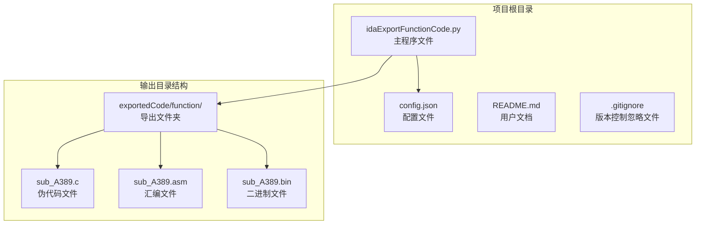

**图表来源**
- [idaExportFunctionCode.py](file://idaExportFunctionCode.py#L1-L815)
- [config.json](file://config.json#L1-L71)

**章节来源**
- [README.md](file://README.md#L1-L148)
- [idaExportFunctionCode.py](file://idaExportFunctionCode.py#L1-L815)
- [config.json](file://config.json#L1-L71)

## 核心组件

### 主要模块架构

该工具采用模块化设计，主要分为以下几个核心模块：

1. **配置管理模块**：负责加载和解析 JSON 配置文件
2. **实用工具模块**：提供通用的辅助函数
3. **导出逻辑模块**：实现不同格式的代码导出功能
4. **主控制模块**：协调整个导出流程

### 数据结构设计

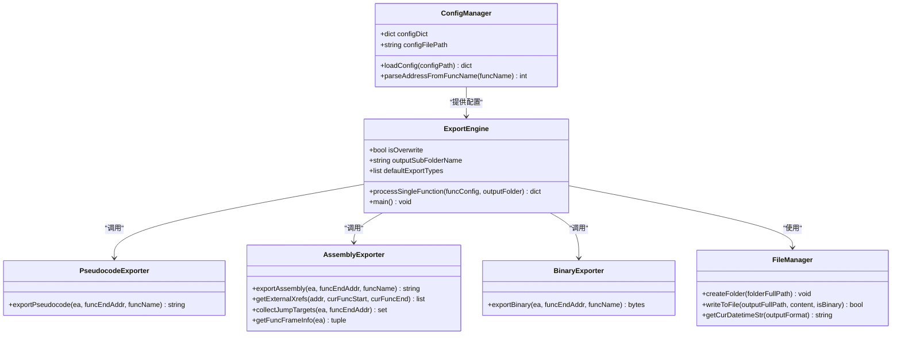

**图表来源**
- [idaExportFunctionCode.py](file://idaExportFunctionCode.py#L31-L56)
- [idaExportFunctionCode.py](file://idaExportFunctionCode.py#L637-L725)

**章节来源**
- [idaExportFunctionCode.py](file://idaExportFunctionCode.py#L25-L62)
- [idaExportFunctionCode.py](file://idaExportFunctionCode.py#L637-L725)

## 架构概览

### 整体系统架构

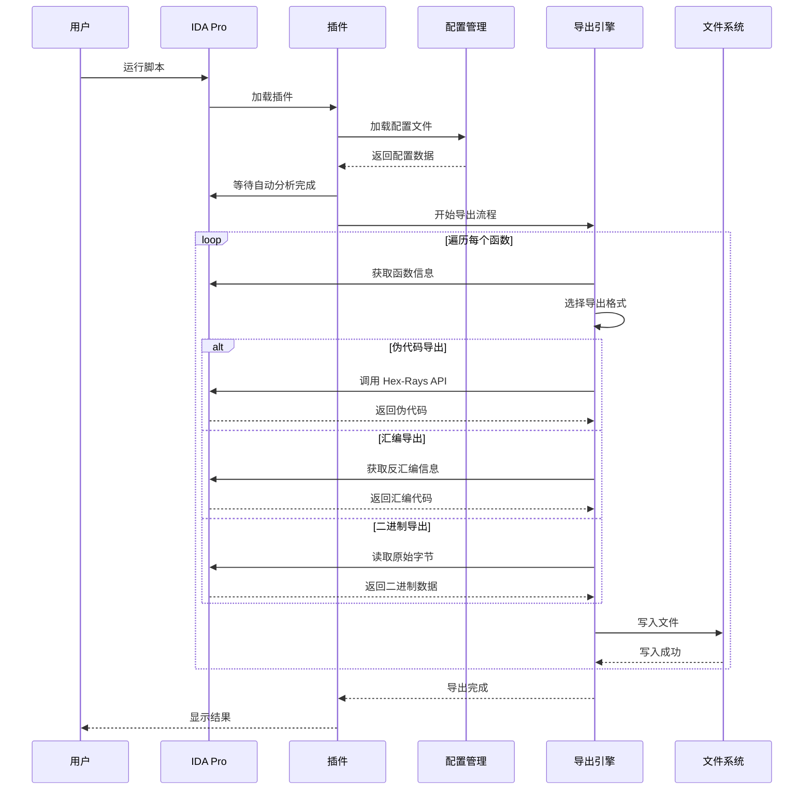

**图表来源**
- [idaExportFunctionCode.py](file://idaExportFunctionCode.py#L731-L815)

### API 集成架构

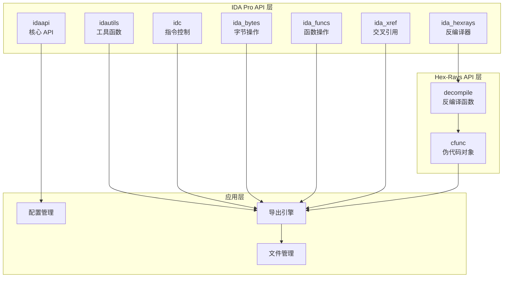

**图表来源**
- [idaExportFunctionCode.py](file://idaExportFunctionCode.py#L9-L16)

## 详细组件分析

### 配置管理系统

配置管理系统是整个工具的核心，负责管理用户定义的导出参数和设置。

#### 配置文件结构

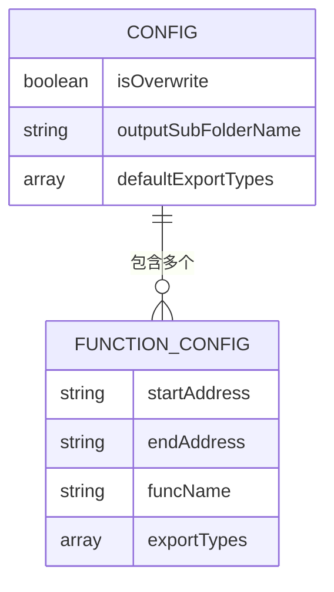

**图表来源**
- [config.json](file://config.json#L1-L71)

#### 配置加载流程

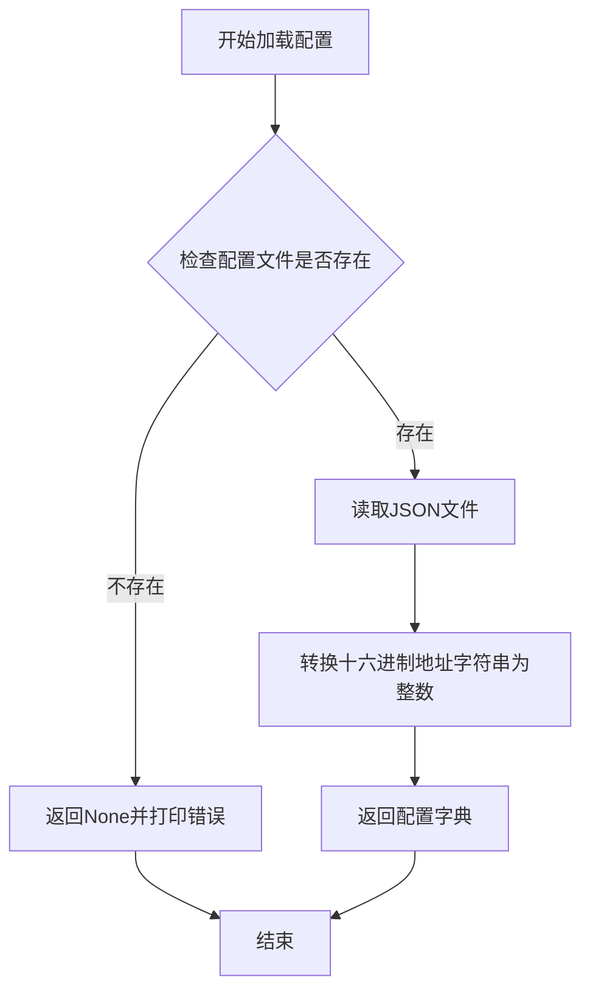

**图表来源**
- [idaExportFunctionCode.py](file://idaExportFunctionCode.py#L31-L56)

**章节来源**
- [config.json](file://config.json#L1-L71)
- [idaExportFunctionCode.py](file://idaExportFunctionCode.py#L31-L56)

### 伪代码导出模块

伪代码导出模块利用 Hex-Rays 反编译器的强大功能，将机器码转换为可读的 C 语言代码。

#### 导出流程

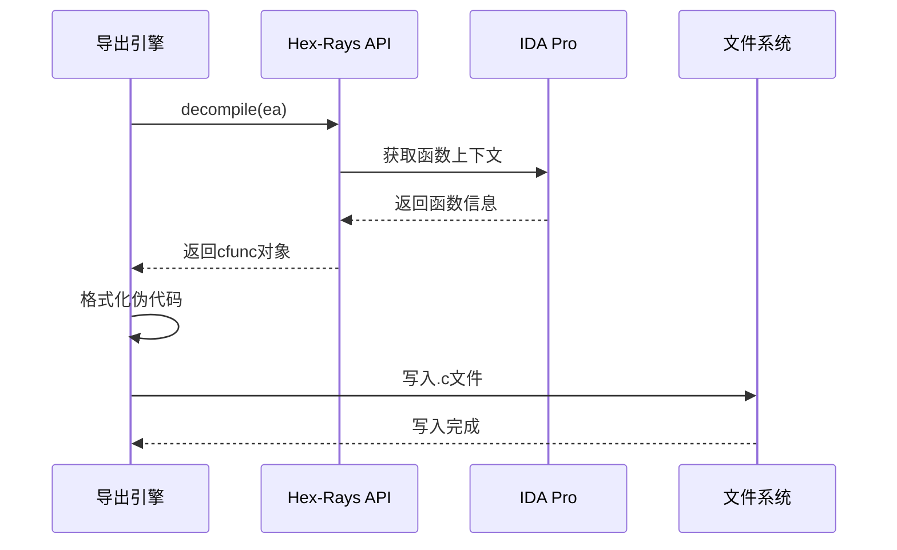

**图表来源**
- [idaExportFunctionCode.py](file://idaExportFunctionCode.py#L93-L115)

#### 错误处理机制

伪代码导出包含完善的错误处理：
- 反编译失败时的异常捕获
- Hex-Rays 插件可用性检查
- 地址解析失败的回退机制

**章节来源**
- [idaExportFunctionCode.py](file://idaExportFunctionCode.py#L93-L115)

### 汇编代码导出模块

汇编代码导出模块实现了 IDA 风格的汇编代码格式化输出。

#### 关键功能实现

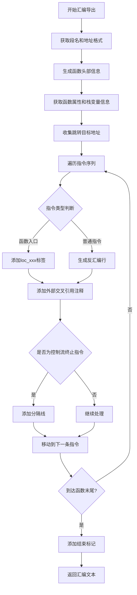

**图表来源**
- [idaExportFunctionCode.py](file://idaExportFunctionCode.py#L373-L521)

#### 交叉引用处理

汇编导出模块实现了智能的交叉引用分析：

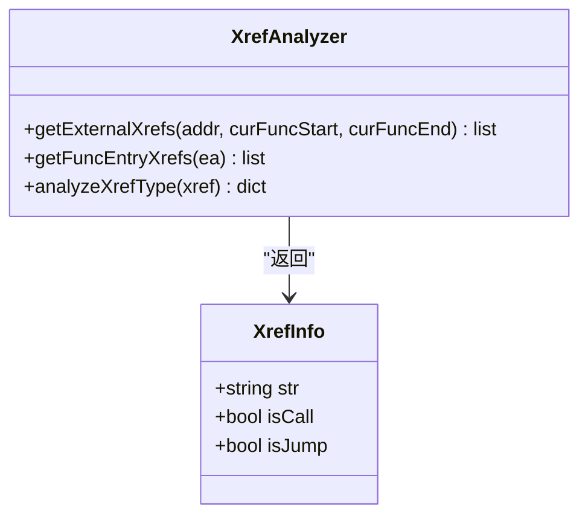

**图表来源**
- [idaExportFunctionCode.py](file://idaExportFunctionCode.py#L116-L171)
- [idaExportFunctionCode.py](file://idaExportFunctionCode.py#L321-L353)

**章节来源**
- [idaExportFunctionCode.py](file://idaExportFunctionCode.py#L373-L521)
- [idaExportFunctionCode.py](file://idaExportFunctionCode.py#L116-L171)
- [idaExportFunctionCode.py](file://idaExportFunctionCode.py#L321-L353)

### 二进制代码导出模块

二进制导出模块直接从内存中提取函数的原始字节数据。

#### 实现特点

- 使用 `ida_bytes.get_bytes()` API 获取连续的字节序列
- 支持任意范围的函数边界
- 提供完整的错误检查和边界验证

**章节来源**
- [idaExportFunctionCode.py](file://idaExportFunctionCode.py#L522-L543)

### 文件管理模块

文件管理模块负责处理所有文件系统的操作。

#### 关键功能

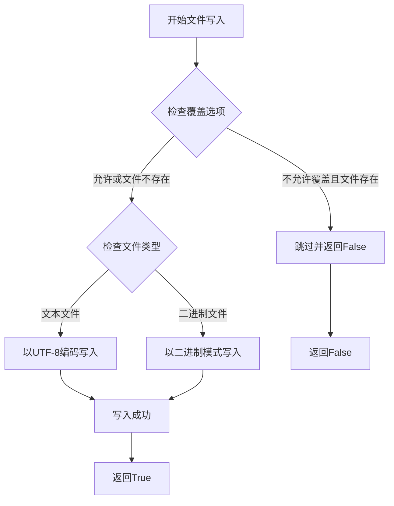

**图表来源**
- [idaExportFunctionCode.py](file://idaExportFunctionCode.py#L544-L566)

**章节来源**
- [idaExportFunctionCode.py](file://idaExportFunctionCode.py#L544-L566)

## 依赖关系分析

### 外部依赖

该工具依赖于 IDA Pro 和 Hex-Rays 的多个 API 模块：

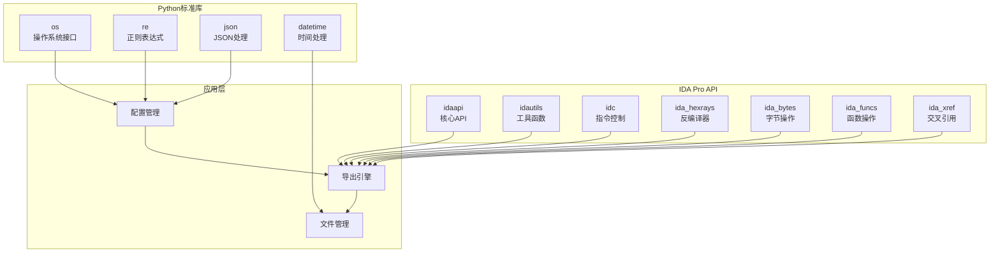

**图表来源**
- [idaExportFunctionCode.py](file://idaExportFunctionCode.py#L9-L21)

### 内部模块依赖

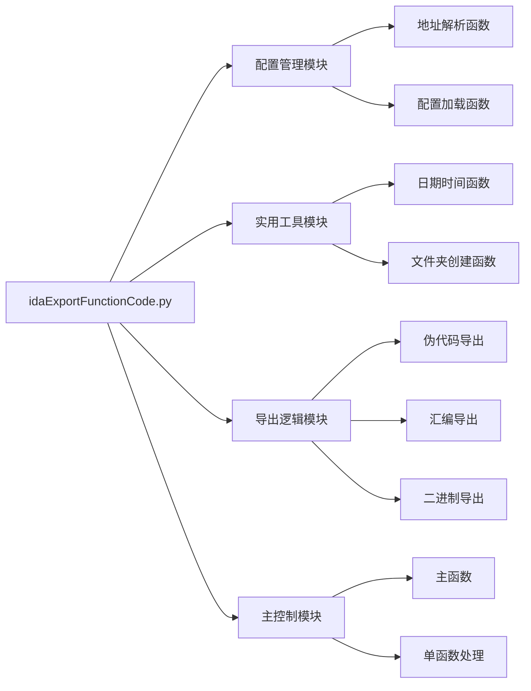

**图表来源**
- [idaExportFunctionCode.py](file://idaExportFunctionCode.py#L31-L815)

**章节来源**
- [idaExportFunctionCode.py](file://idaExportFunctionCode.py#L9-L21)
- [idaExportFunctionCode.py](file://idaExportFunctionCode.py#L31-L815)

## 性能考虑

### 优化策略

1. **延迟初始化**：仅在需要时初始化 Hex-Rays 插件
2. **批量处理**：支持一次性导出多个函数
3. **内存管理**：及时释放不需要的数据结构
4. **I/O 优化**：使用缓冲写入减少磁盘操作

### 性能瓶颈识别

- Hex-Rays 反编译过程可能较慢，特别是对于大型函数
- 大量交叉引用分析的时间复杂度
- 文件系统写入操作的 I/O 延迟

## 故障排除指南

### 常见问题及解决方案

#### 配置文件问题

**问题**：配置文件未找到
**解决方案**：确保 config.json 与脚本位于同一目录

**问题**：十六进制地址格式错误
**解决方案**：检查地址字符串格式，必须包含 "0x" 前缀

#### IDA Pro 集成问题

**问题**：Hex-Rays 插件不可用
**解决方案**：确认已安装 Hex-Rays 反编译器

**问题**：函数信息获取失败
**解决方案**：等待 IDA 自动分析完成后再运行脚本

#### 导出失败问题

**问题**：汇编导出出现反汇编错误
**解决方案**：检查函数边界设置，特别是对于 loc_xxx 标签

**问题**：二进制导出数据为空
**解决方案**：验证函数起始和结束地址的有效性

**章节来源**
- [idaExportFunctionCode.py](file://idaExportFunctionCode.py#L39-L41)
- [idaExportFunctionCode.py](file://idaExportFunctionCode.py#L745-L758)
- [idaExportFunctionCode.py](file://idaExportFunctionCode.py#L532-L542)

## 结论

idaExportFunctionCode 是一个设计精良的 IDA Pro 插件工具，它通过清晰的模块化架构和完善的错误处理机制，为逆向工程师提供了强大而灵活的代码导出能力。该工具的主要优势包括：

1. **高度可配置**：通过 JSON 配置文件实现灵活的导出参数设置
2. **多格式支持**：同时支持伪代码、汇编和二进制三种导出格式
3. **智能集成**：深度集成了 IDA Pro 和 Hex-Rays API
4. **健壮性**：包含完善的错误处理和边界检查机制

该工具为逆向工程工作提供了标准化的代码导出流程，大大提高了工作效率和一致性。

## 附录

### 扩展开发指南

#### 添加新的导出格式

要添加新的导出格式，需要：

1. 在配置文件中添加新的格式标识符
2. 实现相应的导出函数
3. 在主处理流程中注册新格式

#### 修改输出格式

可以通过以下方式修改输出格式：

1. 调整格式化函数的输出模板
2. 修改文件头信息的生成逻辑
3. 调整注释和标签的显示规则

#### 集成其他工具

可以考虑集成以下工具：

1. **静态分析工具**：如 BinDiff、Vivisect
2. **代码质量工具**：如 Clang Static Analyzer
3. **版本控制工具**：自动记录导出历史

### 最佳编程实践

1. **错误处理**：始终进行输入验证和异常捕获
2. **资源管理**：及时释放不再使用的资源
3. **日志记录**：提供详细的进度和错误信息
4. **兼容性**：考虑不同 IDA Pro 版本的兼容性
5. **性能优化**：避免不必要的重复计算和 I/O 操作