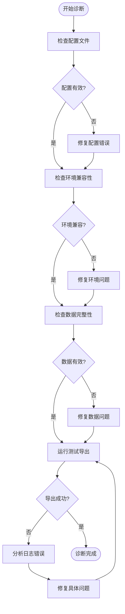

# 故障排除

<cite>
**本文档引用的文件**
- [README.md](file://README.md)
- [config.json](file://config.json)
- [idaExportFunctionCode.py](file://idaExportFunctionCode.py)
- [.gitignore](file://.gitignore)
</cite>

## 目录
1. [简介](#简介)
2. [常见问题分类](#常见问题分类)
3. [配置错误排查](#配置错误排查)
4. [IDA Pro兼容性问题](#ida-pro兼容性问题)
5. [Hex-Rays反编译器问题](#hex-rays反编译器问题)
6. [文件权限问题](#文件权限问题)
7. [导出失败处理](#导出失败处理)
8. [系统性诊断方法](#系统性诊断方法)
9. [调试技巧](#调试技巧)
10. [环境检查清单](#环境检查清单)
11. [预防性措施](#预防性措施)
12. [日志分析方法](#日志分析方法)
13. [结论](#结论)

## 简介

IDA反汇编函数代码导出工具是一个用于从IDA Pro中批量导出指定函数代码的插件工具。该工具支持导出三种格式：伪代码(.c)、汇编代码(.asm)和二进制代码(.bin)，并提供了灵活的配置选项来满足不同的导出需求。

本故障排除指南旨在帮助用户快速识别和解决在使用该工具时可能遇到的各种问题，包括配置错误、IDA Pro兼容性问题、Hex-Rays反编译器缺失、文件权限问题和导出失败等情况。

## 常见问题分类

根据工具的实现和用户反馈，常见问题可以分为以下几类：

### 配置相关问题
- JSON配置文件格式错误
- 地址格式不正确
- 函数列表为空
- 导出类型不支持

### 环境兼容性问题
- IDA Pro版本不兼容
- Hex-Rays反编译器缺失
- 操作系统权限问题
- 文件路径问题

### 数据导出问题
- 函数地址解析失败
- 反编译失败
- 汇编导出异常
- 二进制数据读取失败

### 运行时错误
- 分析未完成
- 内存不足
- 插件初始化失败

## 配置错误排查

### JSON配置文件验证

**问题症状：**
- 工具启动时报错"Config file not found"
- 导出结果为空或部分失败
- 地址解析异常

**诊断步骤：**
1. 验证config.json文件是否存在且位于脚本同一目录
2. 使用JSON验证工具检查语法正确性
3. 检查必需字段是否完整

**解决方案：**
- 确保config.json文件与idaExportFunctionCode.py在同一目录
- 修正JSON语法错误（逗号、括号匹配等）
- 完善必需的配置项

**Section sources**
- [config.json](file://config.json#L1-L71)
- [idaExportFunctionCode.py](file://idaExportFunctionCode.py#L31-L55)

### 地址格式问题

**问题症状：**
- "Cannot parse address from funcName"错误
- "Invalid size"警告
- 地址转换异常

**诊断步骤：**
1. 检查startAddress格式是否为十六进制字符串
2. 验证funcName模式是否符合xxx_<hexAddress>格式
3. 确认地址范围的有效性

**解决方案：**
- startAddress必须使用"0x"前缀的十六进制格式
- funcName中的地址部分必须为有效的十六进制数
- 确保startAddress小于endAddress

**Section sources**
- [idaExportFunctionCode.py](file://idaExportFunctionCode.py#L616-L635)
- [idaExportFunctionCode.py](file://idaExportFunctionCode.py#L567-L589)

### 函数列表配置

**问题症状：**
- "functionList is empty"错误
- 导出数量为0

**诊断步骤：**
1. 检查functionList数组是否为空
2. 验证每个函数配置的完整性
3. 确认至少有一个必需字段存在

**解决方案：**
- 添加至少一个函数配置到functionList
- 确保每个函数配置包含startAddress或可解析的funcName
- 检查exportTypes配置的有效性

**Section sources**
- [idaExportFunctionCode.py](file://idaExportFunctionCode.py#L741-L743)
- [config.json](file://config.json#L5-L69)

## IDA Pro兼容性问题

### 版本兼容性

**问题症状：**
- 插件初始化失败
- IDA API调用异常
- 功能缺失警告

**诊断步骤：**
1. 检查IDA Pro版本是否支持所需API
2. 验证插件依赖的IDA模块可用性
3. 确认操作系统兼容性

**解决方案：**
- 升级到支持的IDA Pro版本
- 确保安装了完整的IDA Pro组件
- 检查插件加载路径

### 自动分析等待

**问题症状：**
- 导出过程卡住
- 数据不完整

**诊断步骤：**
1. 检查IDA Pro是否已完成自动分析
2. 验证分析状态
3. 确认数据完整性

**解决方案：**
- 等待自动分析完成后运行工具
- 手动触发分析后再运行
- 检查分析日志

**Section sources**
- [idaExportFunctionCode.py](file://idaExportFunctionCode.py#L745-L747)

## Hex-Rays反编译器问题

### 反编译器检测

**问题症状：**
- "Hex-Rays decompiler is not available"警告
- .c文件导出失败
- 反编译功能不可用

**诊断步骤：**
1. 检查Hex-Rays插件是否已安装
2. 验证许可证有效性
3. 确认插件初始化成功

**解决方案：**
- 安装Hex-Rays反编译器插件
- 激活有效许可证
- 重启IDA Pro后重试

**Section sources**
- [idaExportFunctionCode.py](file://idaExportFunctionCode.py#L749-L757)

### 伪代码导出限制

**问题症状：**
- 反编译失败但汇编导出正常
- 提示"Could not decompile"错误

**诊断步骤：**
1. 检查目标函数的复杂度
2. 验证指令集支持性
3. 确认内存访问合法性

**解决方案：**
- 尝试简化目标函数
- 检查目标架构支持
- 验证函数完整性

**Section sources**
- [idaExportFunctionCode.py](file://idaExportFunctionCode.py#L103-L114)

## 文件权限问题

### 输出目录权限

**问题症状：**
- "Skip (already exists)"提示
- 文件写入失败
- 权限被拒绝

**诊断步骤：**
1. 检查输出目录是否存在
2. 验证目录写入权限
3. 确认文件覆盖设置

**解决方案：**
- 赋予输出目录写入权限
- 修改isOverwrite配置为true
- 更改输出目录位置

**Section sources**
- [idaExportFunctionCode.py](file://idaExportFunctionCode.py#L554-L556)
- [idaExportFunctionCode.py](file://idaExportFunctionCode.py#L766-L768)

### 文件系统兼容性

**问题症状：**
- 文件名编码问题
- 路径长度限制
- 特殊字符冲突

**诊断步骤：**
1. 检查文件名字符集
2. 验证路径长度限制
3. 确认文件系统支持

**解决方案：**
- 使用ASCII字符的文件名
- 缩短文件路径长度
- 避免特殊字符

**Section sources**
- [idaExportFunctionCode.py](file://idaExportFunctionCode.py#L684-L690)

## 导出失败处理

### 函数地址解析失败

**问题症状：**
- "Cannot determine function end"错误
- 地址边界不明确
- 导出范围异常

**诊断步骤：**
1. 检查startAddress的有效性
2. 验证函数边界定义
3. 确认endAddress配置

**解决方案：**
- 显式指定endAddress
- 使用IDA Pro手动确定边界
- 检查函数完整性

**Section sources**
- [idaExportFunctionCode.py](file://idaExportFunctionCode.py#L567-L589)
- [idaExportFunctionCode.py](file://idaExportFunctionCode.py#L667-L671)

### 汇编导出异常

**问题症状：**
- "Could not disassemble"错误
- 指令解析失败
- 数据格式异常

**诊断步骤：**
1. 检查指令集支持性
2. 验证内存可读性
3. 确认数据完整性

**解决方案：**
- 检查目标架构兼容性
- 验证内存映射
- 重新分析目标区域

**Section sources**
- [idaExportFunctionCode.py](file://idaExportFunctionCode.py#L504-L505)
- [idaExportFunctionCode.py](file://idaExportFunctionCode.py#L480-L505)

### 二进制数据读取失败

**问题症状：**
- "Could not read bytes"警告
- 数据长度为0
- 内存访问异常

**诊断步骤：**
1. 检查数据范围有效性
2. 验证内存可读性
3. 确认缓冲区大小

**解决方案：**
- 重新计算函数大小
- 检查内存保护设置
- 验证数据完整性

**Section sources**
- [idaExportFunctionCode.py](file://idaExportFunctionCode.py#L532-L542)

## 系统性诊断方法

### 逐步验证流程

**图表来源**
- [idaExportFunctionCode.py](file://idaExportFunctionCode.py#L731-L815)

### 错误分类处理

| 错误类型 | 典型症状 | 处理策略 |
|---------|---------|---------|
| 配置错误 | JSON语法错误、字段缺失 | 验证配置文件、完善必需字段 |
| 环境问题 | 插件缺失、权限不足 | 安装必要组件、调整权限设置 |
| 数据问题 | 地址无效、内存访问失败 | 修正数据格式、验证数据完整性 |
| 运行时错误 | 分析未完成、API调用失败 | 等待分析完成、检查API兼容性 |

## 调试技巧

### 日志分析技巧

**详细日志记录：**
- 工具会输出详细的处理进度和错误信息
- 每个函数导出都会显示具体的处理状态
- 支持查看导出结果的统计信息

**关键日志点：**
1. 配置加载阶段的日志
2. 函数处理过程的日志
3. 导出结果的汇总日志

**Section sources**
- [idaExportFunctionCode.py](file://idaExportFunctionCode.py#L731-L815)

### 调试模式启用

**建议的调试步骤：**
1. 在IDA Pro中启用详细日志输出
2. 逐个函数进行测试导出
3. 检查中间结果和临时文件
4. 分析错误发生的具体位置

### 性能监控

**监控要点：**
- 导出时间统计
- 内存使用情况
- 磁盘空间占用
- 并发处理性能

## 环境检查清单

### 必需组件检查

**IDA Pro组件：**
- [ ] IDA Pro主程序
- [ ] IDA SDK组件
- [ ] 目标架构支持
- [ ] 分析引擎完整

**插件组件：**
- [ ] Hex-Rays反编译器
- [ ] IDA API库
- [ ] Python支持
- [ ] 脚本执行环境

**系统要求：**
- [ ] 支持的操作系统版本
- [ ] 足够的磁盘空间
- [ ] 合适的内存容量
- [ ] 网络连接（如需要）

### 配置验证清单

**基本配置：**
- [ ] config.json文件存在
- [ ] functionList配置完整
- [ ] 地址格式正确
- [ ] 导出类型有效

**高级配置：**
- [ ] 输出目录权限正确
- [ ] 覆盖设置符合预期
- [ ] 默认导出类型合理
- [ ] 特殊函数配置正确

## 预防性措施

### 配置管理最佳实践

**配置文件维护：**
- 定期备份配置文件
- 使用版本控制管理配置变更
- 建立配置验证机制
- 制定配置更新流程

**数据完整性保护：**
- 导出前进行数据备份
- 验证函数边界定义
- 检查内存访问权限
- 确认数据格式正确性

### 环境稳定性维护

**系统维护：**
- 定期更新IDA Pro版本
- 保持插件组件最新
- 清理临时文件和缓存
- 监控系统资源使用

**安全防护：**
- 限制文件写入权限
- 防止恶意配置注入
- 验证输入数据安全性
- 建立访问控制机制

## 日志分析方法

### 错误信息解读

**常见错误类型及含义：**

| 错误类型 | 错误信息 | 可能原因 | 解决方案 |
|---------|---------|---------|---------|
| 配置错误 | "Config file not found" | 配置文件缺失或路径错误 | 检查文件位置和权限 |
| 地址错误 | "Cannot parse address" | 地址格式不正确 | 修正为标准十六进制格式 |
| 环境错误 | "Hex-Rays decompiler not available" | 反编译器未安装或禁用 | 安装并激活Hex-Rays插件 |
| 数据错误 | "Could not decompile" | 函数分析不完整 | 等待分析完成或手动分析 |
| 权限错误 | "Permission denied" | 文件权限不足 | 调整文件夹权限或使用管理员账户 |

### 日志分析工具

**推荐的日志分析方法：**
1. 使用文本编辑器搜索特定错误关键词
2. 按时间顺序分析日志条目
3. 关注错误发生的上下文信息
4. 对比成功和失败案例的差异

**Section sources**
- [idaExportFunctionCode.py](file://idaExportFunctionCode.py#L40-L41)
- [idaExportFunctionCode.py](file://idaExportFunctionCode.py#L112-L114)
- [idaExportFunctionCode.py](file://idaExportFunctionCode.py#L755-L757)

## 结论

通过本故障排除指南，用户应该能够系统地识别和解决IDA反汇编函数代码导出工具使用过程中遇到的各种问题。关键在于：

1. **预防为主**：建立完善的配置管理和环境检查机制
2. **系统诊断**：按照既定的诊断流程逐步排查问题
3. **快速定位**：利用详细的日志信息准确定位问题根因
4. **有效解决**：采用针对性的解决方案及时修复问题

建议用户在日常使用中：
- 定期进行环境健康检查
- 建立问题快速响应机制
- 维护详细的使用文档和故障记录
- 培训团队成员掌握基本的故障排除技能

这样可以最大程度地减少工具使用中的问题，提高工作效率和质量。