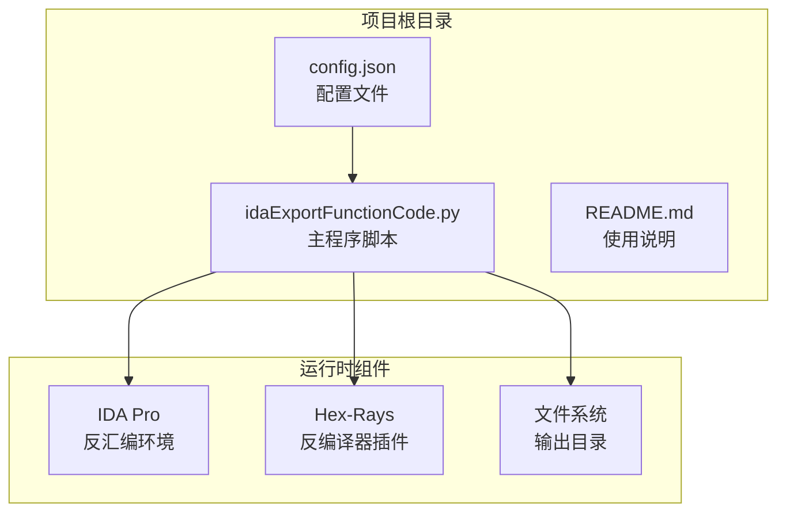
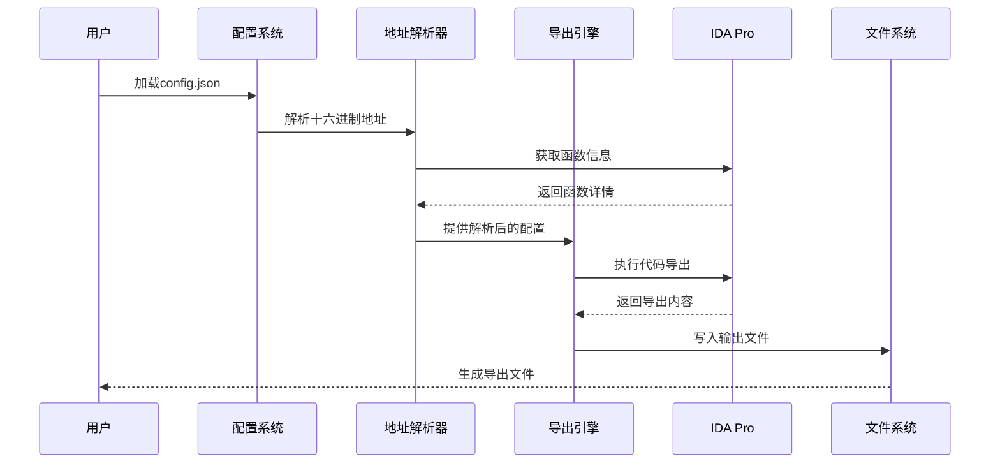
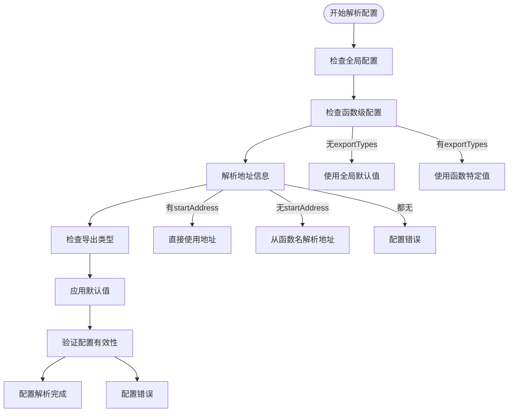
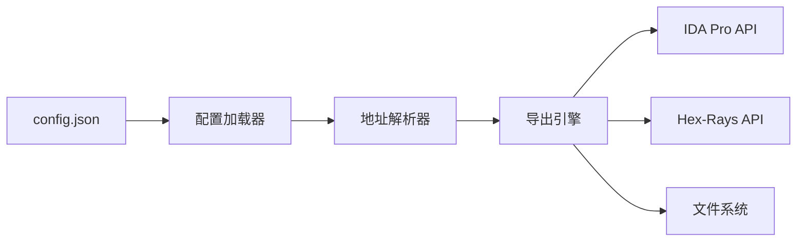

# 配置详解

<cite>
**本文档引用的文件**
- [config.json](file://config.json)
- [idaExportFunctionCode.py](file://idaExportFunctionCode.py)
- [README.md](file://README.md)
</cite>

## 目录
1. [简介](#简介)
2. [项目结构](#项目结构)
3. [核心配置组件](#核心配置组件)
4. [架构概览](#架构概览)
5. [详细配置分析](#详细配置分析)
6. [依赖关系分析](#依赖关系分析)
7. [性能考虑](#性能考虑)
8. [故障排除指南](#故障排除指南)
9. [结论](#结论)

## 简介

IDA反汇编函数代码导出工具是一个用于从IDA Pro中批量导出指定函数代码的插件。该工具通过JSON配置文件定义要导出的函数列表以及导出选项，支持多种输出格式包括伪代码(.c)、汇编代码(.asm)和二进制数据(.bin)。

本工具的核心功能是：
- 批量处理多个函数的代码导出
- 支持多种导出格式和自定义输出路径
- 提供灵活的配置选项以满足不同的导出需求
- 自动处理地址解析和函数信息提取

## 项目结构

该项目采用简洁的单文件架构，主要包含以下组件：

**图表来源**
- [config.json](file://config.json#L1-L71)
- [idaExportFunctionCode.py](file://idaExportFunctionCode.py#L1-L815)

**章节来源**
- [config.json](file://config.json#L1-L71)
- [idaExportFunctionCode.py](file://idaExportFunctionCode.py#L1-L815)

## 核心配置组件

### 全局配置参数

全局配置参数位于config.json文件的顶层，影响整个导出过程的行为：

| 参数名 | 数据类型 | 默认值 | 取值范围 | 使用场景 |
|--------|----------|--------|----------|----------|
| isOverwrite | 布尔值 | true | true/false | 控制是否覆盖已存在的输出文件 |
| outputSubFolderName | 字符串 | "exportedCode/function" | 任意有效文件夹名称 | 指定输出文件夹路径 |
| defaultExportTypes | 数组 | [".c", ".asm", ".bin"] | 任意组合的导出类型 | 为所有函数设置默认导出格式 |

### 函数级配置参数

函数级配置参数定义在functionList数组中的每个对象里，用于指定具体函数的导出行为：

| 参数名 | 数据类型 | 必需性 | 取值范围 | 使用场景 |
|--------|----------|--------|----------|----------|
| startAddress | 十六进制字符串 | 至少一个必需 | "0x"前缀的十六进制数 | 指定函数起始地址 |
| endAddress | 十六进制字符串 | 可选 | "0x"前缀的十六进制数 | 指定函数结束地址 |
| funcName | 字符串 | 可选 | 任意有效函数名称 | 指定函数名称 |
| exportTypes | 数组 | 可选 | [".c", ".asm", ".bin"]的子集 | 覆盖默认导出类型 |

**章节来源**
- [config.json](file://config.json#L1-L71)
- [idaExportFunctionCode.py](file://idaExportFunctionCode.py#L26-L62)

## 架构概览

工具的整体架构采用分层设计，从配置加载到执行导出的完整流程如下：

**图表来源**
- [idaExportFunctionCode.py](file://idaExportFunctionCode.py#L31-L55)
- [idaExportFunctionCode.py](file://idaExportFunctionCode.py#L637-L725)

## 详细配置分析

### 全局配置参数详解

#### isOverwrite 参数
- **数据类型**: 布尔值
- **默认值**: true
- **作用**: 控制当目标文件已存在时是否覆盖
- **使用场景**: 
  - 开发调试阶段：建议保持true以便快速迭代
  - 生产环境：可根据需要调整以避免意外覆盖

#### outputSubFolderName 参数
- **数据类型**: 字符串
- **默认值**: "exportedCode/function"
- **作用**: 指定输出文件夹的相对路径
- **使用场景**:
  - 与输入文件同目录的子文件夹结构
  - 支持相对路径和绝对路径

#### defaultExportTypes 参数
- **数据类型**: 数组
- **默认值**: [".c", ".asm", ".bin"]
- **支持的值**: ".c"、".asm"、".bin"
- **作用**: 为所有函数设置默认的导出格式
- **使用场景**:
  - 需要同时导出多种格式的函数
  - 简化重复配置的工作

### 函数级配置参数详解

#### startAddress 参数
- **数据类型**: 十六进制字符串
- **格式要求**: "0x"前缀的十六进制数
- **解析机制**: 自动转换为十进制整数
- **使用场景**:
  - 直接指定函数起始地址
  - 支持sub_xxx和loc_xxx等地址格式

#### endAddress 参数
- **数据类型**: 十六进制字符串
- **可选性**: 可省略
- **自动检测**: 当省略时从IDA自动获取
- **使用场景**:
  - 精确控制导出范围
  - 处理非标准函数边界

#### funcName 参数
- **数据类型**: 字符串
- **可选性**: 可省略
- **解析规则**: 支持从名称中解析地址后缀
- **使用场景**:
  - 使用标准IDA函数命名
  - 自定义函数标识符

#### exportTypes 参数
- **数据类型**: 数组
- **可选性**: 可省略
- **默认继承**: 继承global defaultExportTypes
- **支持值**: ".c"、".asm"、".bin"
- **使用场景**:
  - 为特定函数定制导出格式
  - 节省存储空间只导出必要格式

### 配置优先级规则

配置参数遵循以下优先级顺序：

**图表来源**
- [idaExportFunctionCode.py](file://idaExportFunctionCode.py#L637-L664)

**章节来源**
- [idaExportFunctionCode.py](file://idaExportFunctionCode.py#L46-L54)
- [idaExportFunctionCode.py](file://idaExportFunctionCode.py#L649-L664)

### 配置验证逻辑

工具实现了多层次的配置验证机制：

#### 基础验证
- 检查配置文件是否存在
- 验证JSON格式的有效性
- 确保必需参数的完整性

#### 地址解析验证
- 验证十六进制字符串格式
- 确认地址在有效范围内
- 处理地址解析失败的情况

#### 功能可用性验证
- 检查Hex-Rays反编译器可用性
- 验证导出类型的兼容性
- 确认输出路径的可写权限

**章节来源**
- [idaExportFunctionCode.py](file://idaExportFunctionCode.py#L31-L55)
- [idaExportFunctionCode.py](file://idaExportFunctionCode.py#L749-L758)

## 依赖关系分析

### 配置文件依赖

**图表来源**
- [idaExportFunctionCode.py](file://idaExportFunctionCode.py#L28-L57)
- [idaExportFunctionCode.py](file://idaExportFunctionCode.py#L637-L725)

### 运行时依赖

工具运行时依赖于IDA Pro提供的各种API：

| 依赖组件 | 功能用途 | 必需性 |
|----------|----------|--------|
| idaapi | 基础IDA API接口 | 必需 |
| idautils | 工具函数集合 | 必需 |
| idc | IDA命令接口 | 必需 |
| ida_hexrays | 反编译器接口 | 可选 |
| ida_bytes | 字节操作接口 | 可选 |
| ida_funcs | 函数操作接口 | 必需 |

**章节来源**
- [idaExportFunctionCode.py](file://idaExportFunctionCode.py#L9-L16)

## 性能考虑

### 导出性能优化

1. **批量处理**: 支持一次性导出多个函数，减少重复初始化开销
2. **智能跳过**: 当文件已存在且不允许覆盖时自动跳过
3. **内存管理**: 合理管理大文件的内存使用
4. **进度反馈**: 提供详细的处理进度和状态信息

### 配置优化建议

1. **合理选择导出格式**: 根据实际需求选择必要的导出类型
2. **精确指定地址范围**: 避免不必要的大范围扫描
3. **使用合适的输出路径**: 避免在性能较差的存储设备上写入大量文件

## 故障排除指南

### 常见配置错误及解决方案

#### 配置文件加载失败
**问题**: "[Error] Config file not found: config.json"
**原因**: 配置文件路径不正确或文件不存在
**解决方案**: 
- 确认config.json与脚本在同一目录
- 检查文件权限设置
- 验证文件路径的正确性

#### 地址格式错误
**问题**: 地址解析失败或返回None
**原因**: 十六进制字符串格式不正确
**解决方案**:
- 确保使用"0x"前缀
- 检查十六进制字符的有效性
- 验证地址在目标程序范围内

#### 函数信息获取失败
**问题**: 无法确定函数结束地址
**原因**: 未指定endAddress且IDA无法自动检测
**解决方案**:
- 明确指定endAddress参数
- 确认函数地址的有效性
- 检查IDA数据库的完整性

#### 反编译器不可用
**问题**: "[Error] Hex-Rays decompiler is not available"
**原因**: 缺少Hex-Rays反编译器插件
**解决方案**:
- 安装并启用Hex-Rays反编译器
- 确认许可证的有效性
- 检查IDA版本兼容性

#### 输出文件冲突
**问题**: 文件已存在但不允许覆盖
**解决方案**:
- 设置isOverwrite为true
- 修改outputSubFolderName避免冲突
- 手动删除现有文件

**章节来源**
- [idaExportFunctionCode.py](file://idaExportFunctionCode.py#L39-L41)
- [idaExportFunctionCode.py](file://idaExportFunctionCode.py#L588-L589)
- [idaExportFunctionCode.py](file://idaExportFunctionCode.py#L754-L757)

## 结论

IDA反汇编函数代码导出工具提供了灵活而强大的配置系统，能够满足各种复杂的代码导出需求。通过合理的配置策略，用户可以：

1. **精确控制导出范围**: 通过startAddress和endAddress精确定义函数边界
2. **灵活选择导出格式**: 支持.c、.asm、.bin三种格式的组合使用
3. **优化性能表现**: 通过合理的配置减少不必要的处理开销
4. **提高工作效率**: 批量处理多个函数，自动化导出流程

建议在实际使用中：
- 根据具体需求定制配置参数
- 定期验证配置的有效性
- 建立标准化的配置模板
- 妥善管理输出文件的组织结构

通过深入理解和正确使用这些配置选项，用户可以充分发挥该工具的潜力，高效地完成各种代码导出任务。