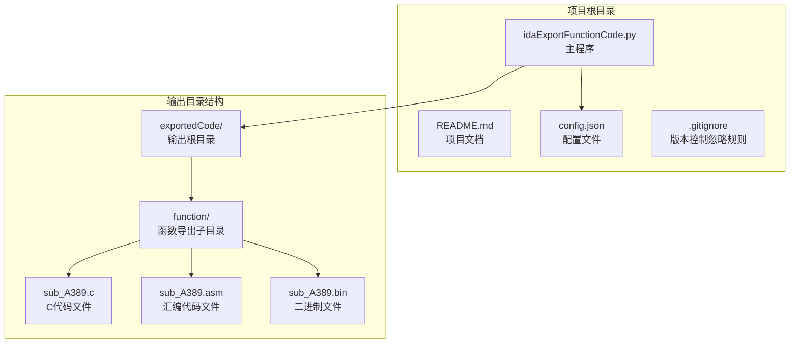
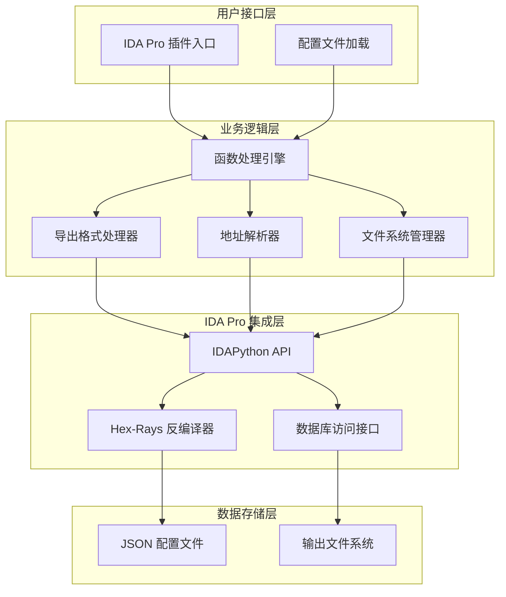
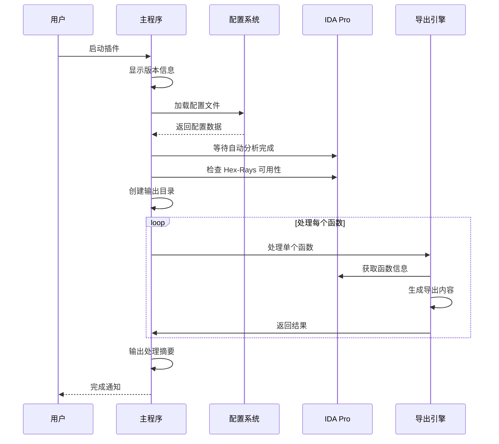
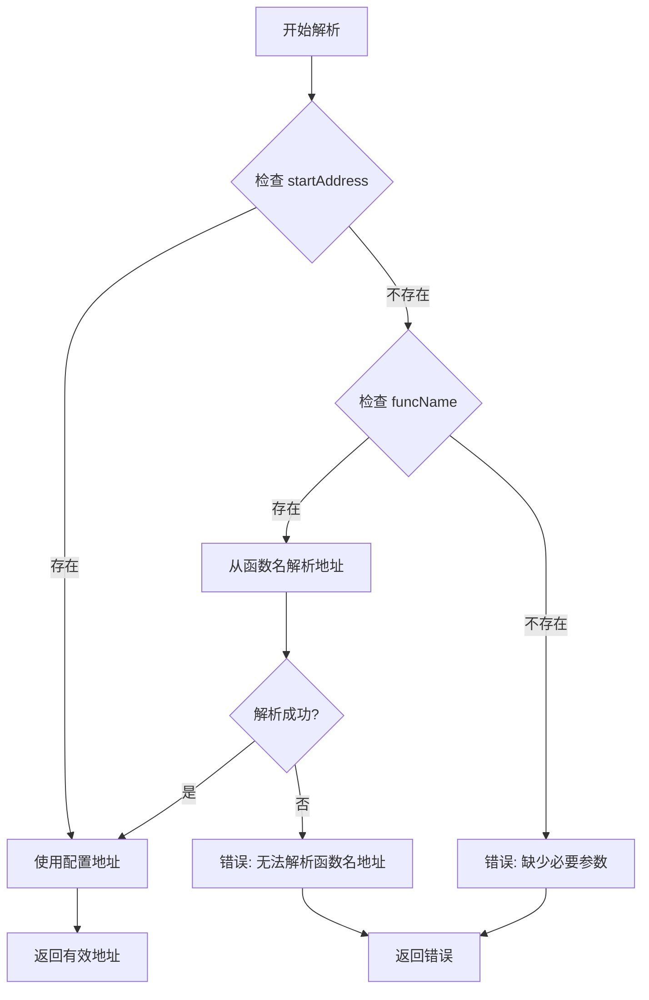
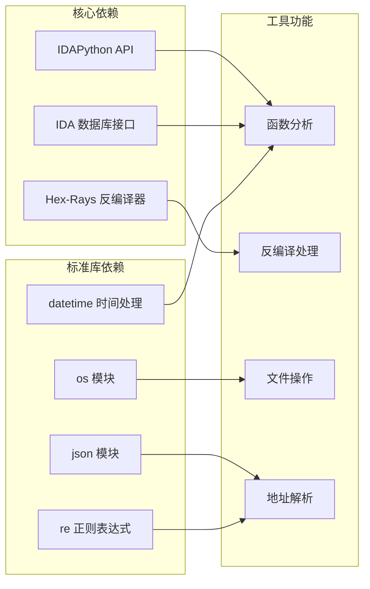
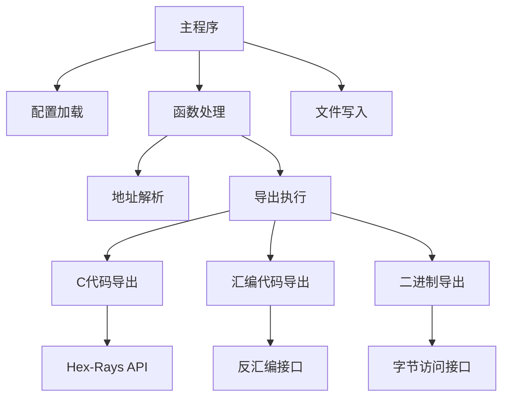

# 项目概述

<cite>
**本文档引用的文件**
- [README.md](file://README.md)
- [config.json](file://config.json)
- [idaExportFunctionCode.py](file://idaExportFunctionCode.py)
- [.gitignore](file://.gitignore)
</cite>

## 目录
1. [简介](#简介)
2. [项目结构](#项目结构)
3. [核心组件](#核心组件)
4. [架构概览](#架构概览)
5. [详细组件分析](#详细组件分析)
6. [依赖关系分析](#依赖关系分析)
7. [性能考虑](#性能考虑)
8. [故障排除指南](#故障排除指南)
9. [结论](#结论)

## 简介

idaExportFunctionCode 是一个专为 IDA Pro 反汇编器设计的插件工具，用于将指定的函数代码导出到文件中。该工具在逆向工程和二进制分析领域具有重要价值，能够帮助安全研究人员、软件分析师和开发者高效地提取和保存关键的函数代码信息。

### 核心目的

该工具的主要目标是简化 IDA Pro 中函数代码的批量导出过程，支持多种输出格式以满足不同的分析需求：
- **C代码导出**：通过 Hex-Rays 反编译器生成可读的伪代码
- **汇编代码导出**：生成符合 IDA 风格的汇编代码
- **二进制数据导出**：提取原始字节码数据

### 主要功能特性

- **多格式支持**：同时支持 .c、.asm、.bin 三种导出格式
- **灵活的配置系统**：通过 JSON 配置文件进行参数设置
- **批量处理能力**：可以一次性处理多个函数
- **智能地址解析**：支持多种地址格式和函数名解析
- **完整的交叉引用信息**：在汇编代码中包含详细的调用关系

### 应用场景

该工具特别适用于以下场景：
- **漏洞研究**：导出可疑函数进行深入分析
- **恶意软件分析**：提取恶意代码片段进行研究
- **软件逆向**：保存关键函数的源代码等价物
- **取证分析**：保留分析过程中发现的重要代码片段
- **代码审计**：批量导出特定模块的实现代码

## 项目结构

该项目采用简洁而高效的单文件架构设计，包含以下核心文件：

**图表来源**
- [idaExportFunctionCode.py](file://idaExportFunctionCode.py#L28-L62)
- [config.json](file://config.json#L1-L71)

**章节来源**
- [README.md](file://README.md#L1-L148)
- [idaExportFunctionCode.py](file://idaExportFunctionCode.py#L1-L815)

## 核心组件

### 配置管理系统

配置系统是该工具的核心，采用 JSON 格式定义导出行为。配置文件支持全局设置和函数级定制：

#### 全局配置参数
- `isOverwrite`：控制是否覆盖已存在的输出文件
- `outputSubFolderName`：指定输出子目录名称
- `defaultExportTypes`：定义默认的导出格式列表

#### 函数配置参数
- `startAddress`：函数起始地址（十六进制字符串）
- `endAddress`：函数结束地址（可选）
- `funcName`：函数名称（可选）
- `exportTypes`：该函数的导出格式列表（可选）

**章节来源**
- [README.md](file://README.md#L28-L72)
- [config.json](file://config.json#L1-L71)

### 导出引擎

导出引擎负责将函数代码转换为指定格式并写入文件系统。它支持三种不同的导出类型：

#### C代码导出（.c）
利用 Hex-Rays 反编译器生成高质量的伪代码，包含完整的变量类型信息和注释。

#### 汇编代码导出（.asm）
生成符合 IDA 风格的汇编代码，包含：
- 16位段前缀的完整地址格式
- 函数原型注释
- 变量定义和格式化偏移
- 控制流标记（__unwind）
- 详细的交叉引用信息

#### 二进制数据导出（.bin）
直接提取函数的原始字节码，用于底层分析和验证。

**章节来源**
- [README.md](file://README.md#L14-L18)
- [idaExportFunctionCode.py](file://idaExportFunctionCode.py#L93-L542)

## 架构概览

该工具采用模块化的架构设计，将不同功能职责清晰分离：

**图表来源**
- [idaExportFunctionCode.py](file://idaExportFunctionCode.py#L9-L21)
- [idaExportFunctionCode.py](file://idaExportFunctionCode.py#L731-L815)

### 设计模式

该工具采用了以下设计模式：

#### 配置驱动模式
通过外部配置文件控制程序行为，实现了高度的灵活性和可定制性。

#### 模块化设计
将不同功能封装在独立的函数中，便于测试和维护。

#### 失败安全模式
对各种可能的错误情况进行处理，确保程序的稳定性。

**章节来源**
- [idaExportFunctionCode.py](file://idaExportFunctionCode.py#L31-L57)
- [idaExportFunctionCode.py](file://idaExportFunctionCode.py#L637-L725)

## 详细组件分析

### 主程序流程

主程序执行流程遵循严格的步骤顺序，确保所有依赖项正确初始化：

**图表来源**
- [idaExportFunctionCode.py](file://idaExportFunctionCode.py#L731-L815)

### 地址解析机制

地址解析是该工具的关键功能之一，支持多种输入格式：

**图表来源**
- [idaExportFunctionCode.py](file://idaExportFunctionCode.py#L616-L635)
- [idaExportFunctionCode.py](file://idaExportFunctionCode.py#L646-L660)

### 导出格式处理器

每种导出格式都有专门的处理器，负责生成相应的输出内容：

#### C代码处理器
- 调用 Hex-Rays 反编译器
- 格式化函数注释
- 处理异常情况

#### 汇编代码处理器
- 收集函数属性信息
- 解析交叉引用关系
- 生成格式化的指令列表

#### 二进制处理器
- 计算函数大小
- 读取原始字节数据
- 错误处理和验证

**章节来源**
- [idaExportFunctionCode.py](file://idaExportFunctionCode.py#L93-L114)
- [idaExportFunctionCode.py](file://idaExportFunctionCode.py#L373-L520)
- [idaExportFunctionCode.py](file://idaExportFunctionCode.py#L522-L542)

## 依赖关系分析

### 外部依赖

该工具依赖于 IDA Pro 的 Python API 和相关的插件：

**图表来源**
- [idaExportFunctionCode.py](file://idaExportFunctionCode.py#L9-L21)

### 内部模块依赖

工具内部模块之间的依赖关系相对简单，主要通过函数调用来实现：

**图表来源**
- [idaExportFunctionCode.py](file://idaExportFunctionCode.py#L31-L57)
- [idaExportFunctionCode.py](file://idaExportFunctionCode.py#L637-L725)

**章节来源**
- [idaExportFunctionCode.py](file://idaExportFunctionCode.py#L9-L21)
- [idaExportFunctionCode.py](file://idaExportFunctionCode.py#L637-L725)

## 性能考虑

### 批量处理优化

该工具针对大量函数导出进行了优化：
- 使用 IDA 的异步分析等待机制
- 合理的内存管理策略
- 避免重复的数据库查询操作

### 内存使用优化

- 逐函数处理，避免一次性加载所有数据
- 及时释放不再使用的变量
- 二进制数据的分块写入

### I/O 性能

- 批量创建输出目录
- 合并相似的文件操作
- 使用缓冲的文件写入

## 故障排除指南

### 常见问题及解决方案

#### Hex-Rays 不可用
**症状**：尝试导出 .c 文件时报错
**原因**：Hex-Rays 反编译器未安装或未启用
**解决方法**：确保 Hex-Rays 正确安装并在 IDA 中启用

#### 地址解析失败
**症状**：无法确定函数边界
**原因**：缺少 endAddress 配置
**解决方法**：在配置中明确指定函数结束地址

#### 权限错误
**症状**：无法创建输出文件
**原因**：输出目录权限不足
**解决方法**：检查并修改输出目录的写入权限

#### 内存不足
**症状**：大函数导出失败
**原因**：可用内存不足
**解决方法**：分批处理函数或增加系统内存

**章节来源**
- [idaExportFunctionCode.py](file://idaExportFunctionCode.py#L749-L758)
- [idaExportFunctionCode.py](file://idaExportFunctionCode.py#L588-L589)
- [idaExportFunctionCode.py](file://idaExportFunctionCode.py#L554-L556)

## 结论

idaExportFunctionCode 是一个设计精良的 IDA Pro 插件工具，它通过简洁的架构和强大的功能为逆向工程工作提供了重要支持。该工具的主要优势包括：

### 技术优势
- **模块化设计**：清晰的功能分离便于维护和扩展
- **配置驱动**：灵活的参数设置适应不同使用场景
- **错误处理**：完善的异常处理机制确保程序稳定性
- **性能优化**：针对批量处理进行了专门优化

### 实用价值
- **提高效率**：自动化批量导出减少手工操作
- **增强分析能力**：支持多种格式满足不同分析需求
- **便于分享**：标准化的输出格式便于团队协作
- **降低门槛**：友好的用户界面和详细的文档

### 发展前景
该工具为 IDA Pro 生态系统提供了有价值的补充，特别是在自动化和批量处理方面。随着逆向工程需求的增长，这类工具的价值将更加凸显。

对于初学者，建议从简单的配置开始，逐步探索高级功能。对于有经验的开发者，可以基于此工具进行扩展，添加更多自定义功能或集成到更大的分析流水线中。